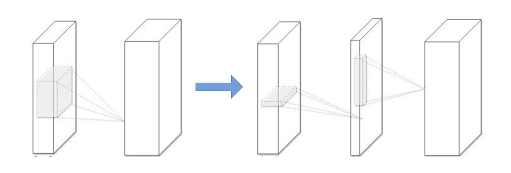
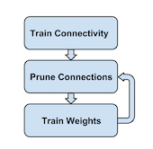

# Paper Reading on Model Compression: Compression and Acceleration

## 1. A Survey of Model Compression and Acceleration for Deep Neural Networks

### 1.1 Abstract

> Deep convolutional neural networks (CNNs) have recently achieved great success in many visual recognition tasks. However, existing deep neural network models are computationally expensive and memory intensive, hindering their deployment in devices with low memory resources or in applications with strict latency requirements. Therefore, a natural thought is to perform model compression and acceleration in deep networks without significantly decreasing the model performance. During the past few years, tremendous progress has been made in this area. In this paper, we survey the recent advanced techniques for compacting and accelerating CNNs model developed. These techniques are roughly categorized into four schemes: parameter pruning and sharing, low-rank factorization, transferred/compact convolutional filters, and knowledge distillation. Methods of parameter pruning and sharing will be described at the beginning, after that the other techniques will be introduced. For each scheme, we provide insightful analysis regarding the performance, related applications, advantages, and drawbacks etc. Then we will go through a few very recent additional successful methods, for example, dynamic capacity networks and stochastic depths networks. After that, we survey the evaluation matrix, the main datasets used for evaluating the model performance and recent benchmarking efforts. Finally, we conclude this paper, discuss remaining challenges and possible directions on this topic.

### 1.2 Introduction

Deep networks with billions parameters, GPUs with high computation capability. Two example: ImageNet, LFW dataset. Reducing storage & computational cost is critical, for real-time app. Solutions from many disciplines: ML, optimization, computer arch, data compression, indexing, hardware design.

Four approaches: parameter pruning & sharing, low-rank factorization, transferred/compact convolutinal filters, knowledge distillation.

### 1.3 Parameter Pruning & Sharing

#### 1.3.1 Quantization & Binarization

Reducing the number of bits required to represent each weight.

1. Gong & Wu: K-means scalar quantization to the parameter values.
2. Vanhoucke: 8-bit quantization => significant speed-up, accuracy loss minimal.
3. 16-bit fixed-point representation in stochastic rounding based CNN training, reduced memory usage & float point operations with little loss.
4. Quantized the link weights, Huffman coding, pruning small-weight connections, achieved sota.
5. Hessian weight can measure importance of paramaters, minimize Hessian-weighted quantization errors in average.
6. Some binary weight methods, but accuracy lowered in large nets
7. Proximal Newton algorithm with diagonal Hessian approximation that directly minimizes the loss with respect to the binary weights.
8. Reduced time on float point multiplication by stochastically binarizing weights & converting multiplications to significant changes.

#### 1.3.2 Pruning & Sharing

Reducing network complexity and to address the over-fitting issue.

1. Biased Weight Decay
2. Optimal Brain Damage & Optimal Brain Surgeon, reducing connections by Hessian of loss -> Higher Accuracy than weight decay method \(magnitude-based pruning\).
3. Srinivas & Badu, exploring redundancy among neurons, data-free method to remove redundant neurons.
4. Han, reducing total number of parameters & operations in the entire network.
5. Chen, HashedNets, low-cost hash function, group weights into hash buckets.
6. soft weight-sharing to regularize, quantization and pruning 
7. group sparsity regularization

**Drawbacks**: pruning with $L_1$ & $L_2$ regularization, more iterations to converge; manual setup of parameters

#### 1.3.3 Designing Structural Matrix

FC layer is bottleneck of memory.  $f(\mathbf{x}, \mathbf{M}) = \sigma(\mathbf{Mx})$, while $\mathbf{x}$ is input, $\sigma(\cdot)$ is nonlinear operator, $\mathbf{M}$ is $m \times n$ matrix of paramters.

**Structured matrix**: an $m \times n$ matrix can be described using much fewer parameters than $mn$; which can reduce memory cost & accelerate inference and training stage. A simple & efficient approach is based on circulant projections. Given $\mathbf{r} =(r_0, r_1, \dots, r_{d-1})$, a circulant matrix $\mathbf{R} \in \mathbb{R}^{d \times d}$ is defined as:

$$
\mathbf{R} = \mathrm{circ}(\mathbf{r}) :=
    \begin{bmatrix}
        r_0 & r_{d-1} & \dots & r_2 & r_1 \\
        r_1 & r_0 & r_{d-1} & \ddots & r_2 \\
        \vdots & r_1 & r_0 & \ddots & \vdots \\
        r_{d-2} & \ddots & \ddots & \ddots & r_{d-1} \\
        r_{d-1} & r_{d-2} & \dots & r_1 & r_0
    \end{bmatrix}
$$

The memory cost becomes $\mathcal{O}(d)$ instead of $\mathcal{O}(d^2)$. Using FFT, the computation complexity will be $\mathcal{O}(d\mathrm{log}d)$.

Other methods: Adaptive Fastfood transform matrix; block and multi-level Toeplitz-like matrices; general structured efficient linear layer.

**Drawbacks**: hurt performance; hard to find a proper structural matrix.

### 1.4 Low-rank Factorization and Sparsity

Convolution kernel can be viewed as a 4D tensor. There is a significant amount of redundancy in the 4D tensor, while tensor decomposition can remove the redundancy.

Some methods:

1. History: high dimensional DCT; wavelet systems.
2. Learing separable 1D filters after dictionary learning idea.
3. Low-rank approximation and clustering schemes for the convolutional kernels achieved 2x speedup with 1\% accuracy drop. Different tensor decomposition schemes reports 4.5x speedup with 1\% accuracy drop in text recognition.
4. Canonical Polyadic decomposition: using nonlinear least squares. Batch Normalization decomposition: transforming the activation of the internal hidden units. Both can be used from scatch.

Also, the fully connected layers can be viewed as 2D matrix. There are several works exploiting low-rankness in fc layer.

**Drawbacks**: implementation not easy while decomposition is computationally expensive; current methods is layer-by-layer, but not global parameter compression; model retraining.

### 1.5 Transferred/Compact Convolutional Filters

The translation invariant property and the convolutional weight sharing are important.

**Equivalence**:

$$
\mathcal{T}^{'} \Phi(\mathbf{x}) = \Phi(\mathcal{T}\mathbf{x})
$$

while $\mathbf{x}$ is input, $\Phi(\cdot)$ is network or layer, $\mathcal{T}$ is transform matrix. Applying certain transform $\mathcal{T}$ to a small set of base filters to get a large set of convolutional filters.

1. CRELU: Negation function: $\mathcal{T}(\mathbf{W}_{x})= \mathbf{W}_{x}^{-}$, where $\mathbf{W}_x$ is basis convolutional filter and $\mathbf{W}_{x}^{-}$
is shifts whose activation is opposite. This work achieve 2x compression rate and higher accuracy. Intuition: pair-wise positive-negative constraint more useful.
2. MBA: Multi-bias nonlinearity activation function: $\mathcal{T}^{'} \Phi(\mathbf{x}) = \mathbf{W}_x + \delta$, where $\delta$ are multi-bias factors.
3. CIRC: Combination of rotation: $\mathcal{T}^{'} \Phi(\mathbf{x}) = \mathbf{W}^{T_\theta}$, where $\mathbf{W}^{T_\theta}$ is transformation matrix.
4. DCNN: Set of translation functions: $\mathcal{T}^{'} \Phi(\mathbf{x}) = T(\cdot, x, y)_{x,y \in \{-k, \dots, k\}, (x,y) \neq (0,0)}$, where $T(\cdot,x,y)$ denoted the translation of the first operand by (x, y) along its spatial dimensions. This framework can improve accuracy and achieve paramter efficiency.

**Drawbacks**: 1) competitive performance for wide/flat architectures but not thin/deep ones 2) results unstable in some cases

To replace the loose and over-parametric filters filters with compact blocks will improve the speed. Decomposing 3x3 convolution with 1x1 ones achieved significant acceleration and SqueezeNet created a compact neural network with 50 fewer parameters to AlexNet.

### 1.6 Knowledge Distillation

Compress deep and wide networks into shallower ones, where the compressed model mimick the function learned by the complex model. Shift knowledge from a large teacher model into a small one by learning the class distributions output via softmax.

1. Hinton: student-teacher paradigm; student is penalized by teacher's output; compress ensemble of teacher networks into a student network of similar depth.
2. FitNets: train thin but deep networks to compress wide and shallower networks; make the student mimic the full feature maps of the teacher.
3. Train a parametric student model to approximate a Monte Carlo teacher, using online training and DNN for student.
4. Represent knowledge by using higher hidden layer neurons: same information but more compact.
5. Attention Transfer: transfer summaries of the full activations.

**Drawbacks**: KD-based methods can only be applied to classification tasks with softmax loss function. And the model assumptions are too strict to make the performance competitive with other type of approaches.

### 1.7 Other Types of Approaches

1. Attention-based Methods
    1. ABM reduces computations significantly by learning to seletively focus on a few task-relevant input regions.
    2. Dynamic capacity network combines two modules: small sub-networks with low capacity & large ones with high capacity. The first ones are active on full input to find the task-relevant areas, then the attention mechanism direct the last ones to focus-on the task-relevant regions.
    3. Conditional computation: sparsely-gated mixture-of-experts layer(MoE) which consisted of experts, each a feed-forward neural network; using a trainable gating network to select combination of experts to process input.
    4. Dynamic DNN: select and execute a subset of D2NN neurons based on input.
2. Replacing FC with Global Average Pooling
3. Stochastic depth: target Residual Network based model. Pyramidal residual networks with stochastic.
4. Dynamically choose layers to excute during inference.
5. FFT based convolutions; Fast convolution using Winograd algorithm.
6. Stochastic spatial sampling pooling; Detail-preserving pooling based on inverse bilateral filters.

### 1.8 Benchmarks, Evaluation and Databases

#### 1.8.1 Benchmarks

Alexnet, LeNets, All-CNN-nets, NIN, VGG nets, ResNet

#### 1.8.2 Evaluation

$a$ is the number of parameters of original model $M$ while $a^*$ is that of compressed model $M^*$.

Compression rate $\alpha(M, M^*)$ of $M$ over $M^*$ is

$$
\alpha(M, M^*) = \frac{a}{a^*}
$$

Index space saving is

$$
\beta(M, M^*) = \frac{a - a^*}{a^*}
$$

Given running time $s$ of $M$ and $s^*$ of $M^*$, the speedup rate is

$$
\delta(M, M^*) = \frac{s}{s^*}
$$

### 1.9 Discussion and Challenges

Some suggestions, challenges and possible solutions.

Learing-to-learn strategies can automatically learn how to exploit structure in the problem of interest. Leveraging reinforcement learning efficiently to sample the design space and improve the model compression.

Training-based channel pruning methods focus on imposing sparse constraints on weights during training.

For knowledge distillation, selective-KD could be helpful.

## 2. Learning both Weights and Connections for Efficient Neural Networks

### 2.1 Abstract

> Neural networks are both computationally intensive and memory intensive, making them difficult to deploy on embedded systems. Also, conventional networks fix the architecture before training starts; as a result, training cannot improve the architecture. To address these limitations, we describe a method to reduce the storage and computation required by neural networks by an order of magnitude without affecting their accuracy by learning only the important connections. Our method prunes redundant connections using a three-step method. First, we train the network to learn which connections are important. Next, we prune the unim- portant connections. Finally, we retrain the network to fine tune the weights of the remaining connections. On the ImageNet dataset, our method reduced the number of parameters of AlexNet by a factor of 9×, from 61 million to 6.7 million, without incurring accuracy loss. Similar experiments with VGG-16 found that the total number of parameters can be reduced by 13×, from 138 million to 10.3 million, again with no loss of accuracy.

### 2.2 Introduction

The energy of running neural network is beyond the power envelope of a typical mobile device. We need to carry on model size reduction by pruning.

Mian pipeline: initial training -> remove connections less than threshold -> retrain the sparse layer -> repeating pruning and retraining iteratively

This procedure just like synapses in mammalian brain.

### 2.3 Related Work

1. Vanhoucke et al.: 8-bit fixed-point instead of 32-bit floating point.
2. Denton et al.: low-rank approximation of parameters; Gong et al.: vector quantization
3. Network in Network & GoogLenet: replace fc layer by global average pooling
4. Early work: biased weight decay; Optimal Brain Damage; Optimal Brain Surgeon
5. HasedNets: using hash function to randomly group connection weights into hash buckets

### 2.4 Main Method

**Regularization**:

- $L_1$: better after pruning but before retraining
- $L_2$: best pruning results

**Dropout**: As pruning already reduced model capacity, the retraining dropout ratio should be smaller.

$$
C_i = N_i N_{i-1}
$$

$$
D_r = D_o \sqrt{\frac{C_{ir}}{C_{io}}}
$$

During retraining, keep the surviving parameters instead of re-initializing them. To prevent the vanishing gradient problem, fix the parameters for CONV layers and only retrain the FC layers after pruning the FC layers and vice versa.

Iterative pruning can boost pruning rate from 5x to 9x on AlexNet compared with single-step aggresive pruning. The neurons with zero input or zero output connections may be safely pruned due to gradient descent and regularization.
