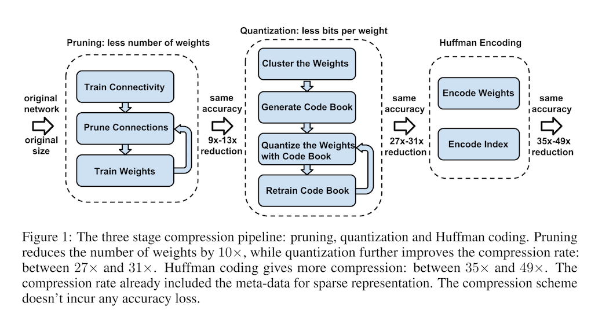

# Paper Reading on Model Compression: Compression and Acceleration (2)

## 3. Deep Compression: Compressing Deep Neural Networks with Pruning, Trained Quantization and Huffman Coding

### 3.1 Abstract

> Neural networks are both computationally intensive and memory intensive, making them difficult to deploy on embedded systems with limited hardware resources. To address this limitation, we introduce “deep compression”, a three stage pipeline: pruning, trained quantization and Huffman coding, that work together to reduce the storage requirement of neural networks by 35× to 49× without affecting their accuracy. Our method first prunes the network by learning only the important connections. Next, we quantize the weights to enforce weight sharing, finally, we apply Huffman coding. After the first two steps we retrain the network to fine tune the remaining connections and the quantized centroids. Pruning, reduces the number of connections by 9× to 13×; Quantization then reduces the number of bits that represent each connection from 32 to 5. On the ImageNet dataset, our method reduced the storage required by AlexNet by 35×, from 240MB to 6.9MB, without loss of accuracy. Our method reduced the size of VGG-16 by 49× from 552MB to 11.3MB, again with no loss of accuracy. This allows fitting the model into on-chip SRAM cache rather than off-chip DRAM memory. Our compression method also facilitates the use of complex neural networks in mobile applications where application size and download bandwidth are constrained. Benchmarked on CPU, GPU and mobile GPU, compressed network has 3× to 4× layerwise speedup and 3× to 7× better energy efficiency.

### 3.2 Introduction

DNN is powerful but consumes considerable storage and memory bandwidth. To reduce the storage and energy required to run inference so that they can be deployed on mobile devices, the authors proposed "deep compression": a three-stage pipeline to reduce the storage required in a manner that preserves the original accuracy. The three stages are as follows:

1. Prune the networking by removing the redundant connections, keeping only the most informative connections
2. Quantize the weights so that multiple connections share the same weight, thus only the codebook and the indices need to be stored
3. Apply Huffman coding to take advantage of the biased distribution of effective weights

### 3.3 Network Pruning

The detailed procedures about network pruning in this paper could be read in [this page](paper_reading_on_model_compression.html). Using compressed sparse column (CSC) and compressed sparse row (CSR) to store the pruned structure. To compress further, we store the index difference with zero padding solution.

### 3.4 Trained Quantization and Weight Sharing

Making multiple connections share the same weight and fine-tune those shared weights to save storage. Refer to the image upon to have a detailed understanding. First quantize the weights into $k$ bins, then we only need to store a small index. During update, the gradients of same bin summed together, multiplied by the learning rate and subtracted from the shared centroids from last iteration. The compression rate can be calculated as:

$$
r = \frac{nb}{n\mathrm{log_2}(k) + kb}
$$

#### 3.4.1 Weight Sharing

Using k-means to identify the shared weights for each layer of a **trained network**, but weights are not shared across layers. Partition $n$ weights $W = \{w_1, w_2, \dots, w_n\}$ into $k$ clusters $C = \{c_1, c_2, \dots, c_k\}$, $n>>k$ by minimize the within-cluster sum of squares(WCSS):

$$
\mathop{\arg\min}\limits_{C} \sum_{i=1}^k \sum_{w \in c_i} \vert w-c_i \vert^2
$$

$$
\argmin_{C} \sum_{i=1}^k \sum_{w \in c_i} \vert w-c_i \vert^2
$$

#### 3.4.2 Initialization of Shared Weights

Centroid initialization impacts the quality of clustering and thus affects accuracy. Examining three methods: random, density-based, and linear. Experiments show that linear initialization works best as larger weights play a more important role than smaller ones but there are fewer of these large weights.

#### 3.4.3 Feed-forward and Back-propagation

During feed forward and back-propagation phase, there is one level of indirection looking up the weight table. Denoting loss by $\mathcal{L}$, weight in $i$th column and $j$th row by $W_{ij}$, centroid index of $W_{ij}$ by $I_{ij}$, $k$th centroid of the layer by $C_k$. The gradient is calculated as:

$$
\frac{\partial \mathcal{L}}{\partial C_k} = \sum_{i,j} \frac{\partial \mathcal{L}}{\partial W_{ij}} \frac{\partial W_{ij}}{\partial C_k} = \sum_{i,j} \frac{\partial \mathcal{L}}{\partial W_{ij}} \mathbb{I} (I_{ij} = k)
$$

### 3.5 Huffman Coding

The probability distribution of quantized weights and the sparse matrix index are biased. Huffman coding these non-uniformly distributed values saves 20\% - 30\% of network storage.

### 3.6 Experiments

The compression pipeline saves network storage by 35x to 49x without loss of accuracy. Using Caffe, pruning is implemented by adding a mask to the blobs to mask out the update of the pruned connections. Quantization and weight sharing are implemented by maintaining a codebook structure that stores the shared weight, and group-by-indexing after calculating the gradient of each layer. Huffman coding is implemented offline after all the fine-tuning is finished.

Experiments includes LeNet-300-100 and LeNet-5 on mnist, AlexNet on ImageNet and VGG-16 on ImageNet.
