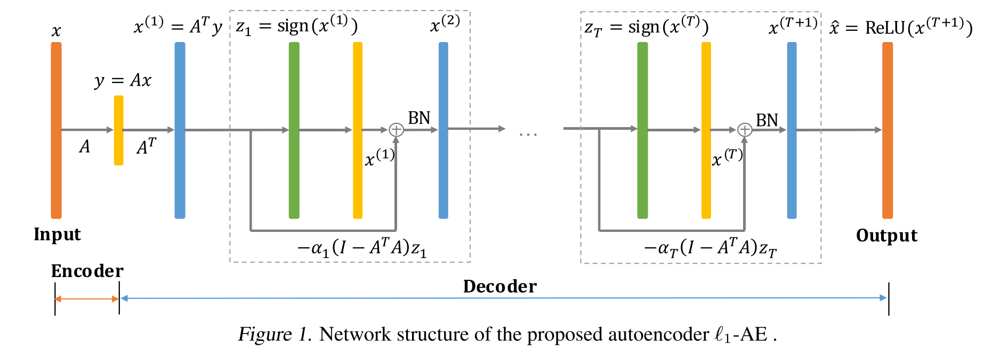

# Paper Reading on Deep Compressed Sensing

## 1. Learning a Compressed Sensing Measurement Matrix via Gradient Unrolling

### 1.1 Abstract

> Linear encoding of sparse vectors is widely popular, but is commonly data-independent – missing any possible extra (but a priori unknown) structure beyond sparsity. In this paper, we present a new method to learn linear encoders that adapt to data, while still performing well with the widely used $\mathcal{l}_1$ decoder. The convex $\mathcal{l}_1$ decoder prevents gradient propagation as needed in standard gradient-based training. Our method is based on the insight that unrolling the convex decoder into T projected subgradient steps can address this issue. Our method can be seen as a data-driven way to learn a compressed sensing measurement matrix. We compare the empirical performance of 10 algorithms over 6 sparse datasets (3 synthetic and 3 real). Our experiments show that there is indeed additional structure beyond sparsity in the real datasets; our method is able to discover it and exploit it to create excellent reconstructions with fewer measurements (by a factor of 1.1-3x) compared to the previous state-of-the-art methods. We illustrate an application of our method in learning label embeddings for extreme multi-label classification, and empirically show that our method is able to match or outperform the precision scores of SLEEC, which is one of the state-of-the-art embedding-based approaches.

### 1.2 Introduction

Design a measurement matrix $A \in \mathbb{R}^{m \times d}$, such that for an ill-posed problem $y = Ax$ where $x \in \mathbb{R}^d$ and $y \in \mathbb{R}^m$, and $m < d$. The problem of designing measurement matrices and reconstruction algorithms that recover sparse vectors from linear observations is called Compressed Sensing (CS), Sparse Approximation or Sparse Recovery Theory.

The problem can be solved as follows:

$$
\argmin _{x' \in \mathbb{R}^d} \parallel x' \parallel _0  \quad \mathrm{s.t.} \quad Ax'=y
$$

But it's a NP-Hard problem. With some properties such as Restricted Isometry Property (RIP) or the nullspace condition (NSP), $\mathcal{l}_0$ norm can be relaxed to $\mathcal{l}_1$ norm:

$$
D(A, y) = \argmin _{x' \in \mathbb{R}^d} \parallel x' \parallel _1  \quad \mathrm{s.t.} \quad Ax'=y
$$

The authors interested in vectors that are not only sparse but have additional structure in their support. They propose a data-driven algorithm that learns a good linear measurement matrix $A$ from data samples. Their linear measurements are subsequently decoded with the $\mathcal{l}_1$-minimization to estimate the unknown vector x.

Our method is an autoencoder for sparse data, with a linear encoder (the measurement matrix) and a complex non-linear decoder that approximately solves an optimization problem.

PCA is a data-driven dimensionality reduction method and an autoencoder with encoder and decoder all linear, and is provides the lowest MSE. Linear encoder has advantages, 1) easy to compute matrix-vector multiplication; 2) easy to interpret as every column of the encoding matrix can be viewed as feature embedding. Arora et al. found that pre-trained word embeddings such as GloVe and word2vec formed a good measurement matrices for text data, which need fewer mearusements than random matrces when used with $\mathcal{l}_1$-minimization.

Given $n$ sparse samples $x_1, x_2, \dots, x_n \in \mathbb{R}^d$, our problem is to find the best $A$:

$$
\min \limits_{A \in \mathbb{R}^{m \times d}} f(A), \quad \mathrm{where} \quad f(A) := \sum_{i=1}^{n} \parallel x_i - D(A, Ax_i) \parallel_2^2
$$

where $D(·,·)$ is the $\mathcal{l}_1$ decoder.

$f(A)$关于$A$的梯度很难求解，因为$D(\cdot, \cdot)$是由一个优化问题确定的。作者的创新点就在这里，将$\mathcal{l}_1$最小化转变成了T步的投影子梯度的更新，这样梯度就可以计算了。即

$$
\begin{aligned}
\hat{f}(A) :&= \sum_{i=1}^n \lVert x_i - \hat{x}_i\rVert^2_2, \mathrm{where} \\
\hat{x}_i &=T\mathrm{step \, subgradient \, of\, } D(A,Ax_i), \mathrm{for}\, i = 1,2,\cdots,n.
\end{aligned}
$$

这个步骤就被称为**梯度展开**（gradient unrolling）。推导过程：

- 原始最小化问题：

$$
\min_{x'\in \mathbb{R}^d} \lVert x' \rVert_1 \quad \mathrm{s.t.} \quad Ax'=y
$$

- 映射子梯度方法的更新为

$$
x^{(t+1)} = \Pi(x^{(t)} - \alpha_t g^{(t)}), \quad \mathrm{where} \quad g^{(t)} = \mathrm{sign}(x^{(t)})
$$

其中，$\Pi$表示到凸集$\{x':Ax'=y\}$上的投影，$g^{(t)}$是符号函数，也就是$\lVert\cdot\rVert_1$在$x^{(t)}$处的子梯度，$\alpha_t$是第t个迭代的步长。因为$A$是行满秩矩阵，$\Pi$有如下闭式解：

$$
\begin{aligned}
\Pi(z) & = \argmin_h\lVert h-z\rVert_2^2 \quad \mathrm{s.t.} Ah=y \\
&=z + \argmin_{h'}\lVert h'\rVert_2^2 \quad \mathrm{s.t.} Ah'=y-Az \\
&= z + A^{+}(y-Az)
\end{aligned}
$$

这里的$A^+ = A^\mathrm{T}(AA^\mathrm{T})^{-1}$是$A$的伪逆。带入上式，又$Ax^{(t)}=y$，有

$$
x^{(t+1)} = x^{(t)} - \alpha_t (I-A^+A)\mathrm{sign}(x^{(t)})
$$

使用$x^{(1)}=A^+y$作为起始点。

根据一个引理，我们有理由使用$A^\mathrm{T}$来替换$A^+$，因为$A^+$的计算很麻烦，而且难以反向传播。具体的引理内容参见论文。最终的迭代形式成为：

$$
x^{(t+1)} = x^{(t)} - \alpha_t (I-A^\mathrm{T}A)\mathrm{sign}(x^{(t)})
$$

引理要求$A$的奇异值都为1，训练时并没有添加这个约束，但是最终得到的测量矩阵和约束集很接近。网络结构如下：

经过$T$个 `block`，输出为$x^{(T+1)}$，再进入激活层，最终输出为$\hat{x}=\mathrm{ReLU}(x^{(T+1)})$。对于给定的n个无标签训练数据，我们训练的目的是减小$x$与$\hat{x}$之间的均方$\mathcal{l}_2$距离：

$$
\min_{A\in \mathbb{R}^{m\times d}, \beta\in \mathbb{R}}\frac{1}{n}\sum_{i=1}^n \lVert x-\hat{x}\rVert_2^2
$$

对于这样学到的线性编码器$A$，我们可以使用$\mathcal{l}_1$解码器进行解码，作者使用`Gurobi`进行解码，因此整套算法可以写成`L1-AE+L1-min pos`。这样学到的编码器与$\mathcal{l}_1$解码器和基于模型的解码器都可以有很好的表现。

作者还发现$L1AE$可以用于XML（极多标签学习）。

## 2. Deep Compressed Sensing

### 2.1 Abstract

> Compressed sensing (CS) provides an elegant framework for recovering sparse signals from compressed measurements. For example, CS can exploit the structure of natural images and recover an image from only a few random measurements. CS is flexible and data efficient, but its application has been restricted by the strong assumption of sparsity and costly reconstruction process. A recent approach that combines CS with neural network generators has removed the constraint of sparsity, but reconstruction remains slow. Here we propose a novel framework that significantly improves both the performance and speed of signal recovery by jointly training a generator and the optimisation process for reconstruction via metalearning. We explore training the measurements with different objectives, and derive a family of models based on minimising measurement errors. We show that Generative Adversarial Nets (GANs) can be viewed as a special case in this family of models. Borrowing insights from the CS perspective, we develop a novel way of improving GANs using gradient information from the discriminator.

压缩传感（CS）提供了一个优雅的框架，可从压缩测量中恢复稀疏信号。例如，CS可以利用自然图像的结构并仅从几个随机测量中恢复图像。CS具有灵活性和数据效率，但是其应用受到稀疏性的强烈假设与昂贵的重建过程的限制。将CS与神经网络生成器结合在一起的最新方法消除了稀疏性的约束，但是重建仍然很慢。在这里，我们提出了一个新颖的框架，该框架通过联合训练生成器和通过元学习进行重构的优化过程，可以显着提高信号恢复的性能和速度。我们探索了**训练具有不同目标的测量**，并基于最小化测量误差得出一系列模型。我们表明，在该系列模型中，可以将生成对抗网络（GAN）视为特例。从CS角度汲取见解，我们开发了一种使用鉴别器中梯度信息来改进GAN的新颖方法。

### 2.2 Introduction

编解码是通信的核心问题，压缩感知（CS）提供了一个将编码和解码分离成独立的测量和重建过程的框架。

- 自动编码器：端到端训练
- CS：在线优化，从低维测量中恢复高维信号，很少或不需训练

但是CS在处理大规模数据时却因为稀疏假设与重建效率而被阻碍。`Bora et al., 2017`将CS与独立训练的神经网络生成器合并。本文则提出深度压缩感知（Deep Compressed Sensing，DCS）框架，神经网络同时对测量和重建从头训练。这个框架自然导出了一系列模型，包括GAN，是通过训练不同目标的测量函数得到。文章的贡献有：

- 展示了如何在CS框架内训练深度神经网络
- 元学习的重建过程导致更精确、数量级上更快的方法
- 开发了基于潜在优化的GAN训练算法，提升了GAN的性能，使用不饱和生成器损失$-\mathrm{ln}(D(G(z))$作为测量误差
- 我们将框架扩展到半监督的GAN，并表明潜在优化在语义上有意义的潜在空间中产生

### 2.3 Background

#### 2.3.1 Compressed Sensing

参考自`Donoho, 2006; Candes et al., 2006`。

$$
\boldsymbol m = \mathbf{F}\boldsymbol x + \eta
$$

式中$\eta$是高斯噪声，$F$为$C\times D$的测量矩阵，$C\ll D$，这样$m$的维度远低于$x$。当$x$是稀疏，且$F$是随机矩阵时，CS可以以很高的概率完美恢复$x$。实践中，$x$的稀疏性要求可以被$x$在某个基$\Phi$下的稀疏性所替代，如傅立叶基或小波基，这样$\Phi x$可以表示非稀疏信号如自然图像等。CS理论的核心是**限制保距性**（Restricted Isometry Property，RIP），其定义为

$$
\begin{aligned}
(1-\delta) \lVert \boldsymbol x_1-\boldsymbol x_2\rVert_2^2 & \leq \lVert \mathbf F(\boldsymbol x_1-\boldsymbol x_2)\rVert_2^2 \\
& \leq (1+\delta)\lVert \boldsymbol x_1+\boldsymbol x_2\rVert_2^2
\end{aligned}
$$

这里$\delta\in(0,1)$，是一个小常数。RIP表明，从$\mathbf F$的投影将距离保留在了由$1-\delta$和$1+\delta$所约束的两个信号之间。对于各种随机矩阵$\mathbf F$和稀疏向量$\boldsymbol x$，这个性质有很高的概率保留。这个性质保证在$\boldsymbol x$稀疏的约束下将测量误差最小化，以很高的概率得到精确的重建$\hat{\boldsymbol x}\approx \boldsymbol x$。重建公式为

$$
\hat{\boldsymbol x} = \argmin_{\boldsymbol x} \lVert \boldsymbol m-\mathbf F\boldsymbol x \rVert_2^2
$$

这个约束优化问题很难计算，但采样过程相对简单。

#### 2.3.2 Compressed Sensing using Generative Models

稀疏性的要求限制了CS的应用，傅立叶基和小波基也只是部分缓解了这种限制，因为它们只能用于已知在这些基中稀疏的域。`Bora et al., 2017`提出使用生成模型的压缩感知（Compressed Sensing using Generative Models, CSGM）放宽这种要求。这个模型使用VAE或GAN预训练的深度神经网络$G_\theta$作为稀疏性的结构约束。这个生成器将一个潜在表示$\boldsymbol z$映射到信号空间：$\boldsymbol x = G_\theta(\boldsymbol z)$。$G_\theta$ 不要求稀疏信号，而是利用其架构和适应数据的权重将输出$\boldsymbol x$隐式地约束在低维流形内。这种约束足以为随机矩阵提供广义的集限制特征值条件（Set-Restricted Eigenvalue Condition，S-REC），可以以较高的概率实现较低的重建误差。重建使用一个类似于CS的最小化过程：

$$
\begin{aligned}
\hat{\boldsymbol z} &= \argmin_{\boldsymbol z} E_\theta(\boldsymbol m,\boldsymbol z) \\
&= \argmin_{\boldsymbol z}\lVert \boldsymbol m - \mathbf FG_\theta(\boldsymbol z)\rVert_2^2
\end{aligned}
$$

重建信号为$\hat{\boldsymbol x} = G_\theta(\boldsymbol z)$。上式$\argmin$难以优化，可从随机采样点$\hat{\boldsymbol z} = p_{\boldsymbol z}(\boldsymbol z)$处开始进行梯度下降

$$
\hat{\boldsymbol z} = \hat{\boldsymbol z} - \alpha\frac{\partial E_\theta(\boldsymbol m,\boldsymbol z)}{\partial \boldsymbol z}\bigg\lvert_{\boldsymbol z=\hat{\boldsymbol z}}
$$

通常，需要数百或数千个梯度下降步骤以及从初始步骤重新启动几个步骤才能获得足够好的$\hat{z}$。`Bora et al., 2017; Bojanowski et al., 2018`。这项工作建立了压缩感知与深度神经网络的联系，且优于Lasso`Tibshirani, 1996`。`Hand & Voroninski, 2017; , Dhar et al., 2018`有在理论与实践上的进展。但仍有两方面的限制：

1. 重建的优化需要上千步梯度下降，依然很慢
2. 依赖于随机测量矩阵，对自然图像这样的高度结构化数据并不是最优的，经过学习的测量可能表现更好

#### 2.3.3 Model-Agnostic Meta-Learning

元学习允许模型通过自我完善来适应新任务，与模型无关的元学习（MAML）提供了一种通用的方法来为许多任务调整参数`Finn et al., 2017`。

#### 2.3.4 Generative Adversarial Networks

生成对抗网络（GAN）训练参数化生成器$G_\theta$欺骗鉴别器$D_\varphi$，该鉴别器试图将真实数据与从生成器采样的虚假数据区分开来`Goodfellow et al., 2014`。

## 3. Compressed Sensing using Generative Models

### 3.1 Abstract

> The goal of compressed sensing is to estimate a vector from an underdetermined system of noisy linear measurements, by making use of prior knowledge on the structure of vectors in the relevant domain. For almost all results in this literature, the structure is represented by sparsity in a well-chosen basis. We show how to achieve guarantees similar to standard compressed sensing but without employing sparsity at all. Instead, we suppose that vectors lie near the range of a generative model $G :  \mathbb{R}^k \Rightarrow \mathbb{R}^n$. Our main theorem is that, if G is L-Lipschitz, then roughly $\mathcal{O}(k \log L)$ random Gaussian measurements suffice for an $l_1/l_2$ recovery guarantee. We demonstrate our results using generative models from published variational autoencoder and generative adversarial networks. Our method can use 5-10x fewer measurements than Lasso for the same accuracy.

压缩感知的目标是通过利用相关域内向量结构的先验知识，从欠定的噪声线性测量系统中估计向量。在几乎所有相关文献的结果里，结构由在精心选择的基中的稀疏性所表示。我们展示了如何在完全不使用稀疏性的情况下实现与标准压缩感知相似的保证。与之相反，我们假设向量位于生成模型$G :  \mathbb{R}^k \Rightarrow \mathbb{R}^n$的范围附近。我们主要的定理是，如果G是L-Lipschitz，那大约$\mathcal{O}(k \log L)$的随机高斯测量足以满足$l_1/l_2$的恢复保证。我们使用已发布的变分自动编码器和生成对抗网络的生成模型展示了我们的结果。我们的方法在相同精度下比Lasso使用少5到10倍的测量。

### 3.2 Introduction

$$
y = Ax^* + \eta
$$

其中，$A\in \mathbb{R}^{m\times n}, x^*\in \mathbb{R}^n, \eta \in \mathbb{R}^m$。这是一个欠定问题，求其最稀疏的解是一个NP难问题。如果A满足RIP或REC等条件，可以将其转化为凸优化问题，得到x的恢复。这方面有很多应用被研究，如计算断层扫描仪（CT），快速MRI等，以及单像素相机。

这篇文章依赖于生成模型产生的结构，而不是稀疏性。VAE、GAN等基于神经网络的生成模型在对数据分布建模上取得很多成果。这些模型的生成部件学习一个从低维表示空间$z\in\mathbb{R}^k$到高维样本空间$G(z)\in \mathbb{R}^n$的映射。训练时，这个映射被鼓励产生与训练集相似的向量，因此可以使用预训练的生成器大致获取我们的域中“自然”向量的概念，因为生成器定义了样本空间向量上的一个分布。

主要创新：提出了一个使用生成模型进行压缩感知的算法。使用梯度下降优化表示$z\in \mathbb{R}^k$，使得对应的图像$G(z)$有更小的测量误差$\lVert AG(z) - y\rVert_2^2$。这个目标函数非凸，但我们发现梯度下降效果很好，结果在很少的测量下优于Lasso。

我们的理论结果表明，只要梯度下降可以找到我们目标的良好近似解，输出$G(z)$就可以几乎与真实的$x^*$一样。

有定理：如果测量矩阵在给定生成器G的范围内满足S-REC，那么最小化测量误差的最佳值接近真实的$x^*$。进一步地，随机高斯测量矩阵很大概率满足大部分的生成器的S-REC条件。

<!-- TODO -->

## 4. Generative Adversarial Nets

### 4.1 Abstract

> We propose a new framework for estimating generative models via an adversarial process, in which we simultaneously train two models: a generative model $G$ that captures the data distribution, and a discriminative model $D$ that estimates the probability that a sample came from the training data rather than $G$. The training procedure for $G$ is to maximize the probability of $D$ making a mistake. This framework corresponds to a minimax two-player game. In the space of arbitrary functions $G$ and $D$, a unique solution exists, with $G$ recovering the training data distribution and $D$ equal to $\frac{1}{2}$ everywhere. In the case where $G$ and $D$ are defined by multilayer perceptrons, the entire system can be trained with backpropagation. There is no need for any Markov chains or unrolled approximate inference networks during either training or generation of samples. Experiments demonstrate the potential of the framework through qualitative and quantitative evaluation of the generated samples.

生成模型$G$与判别模型$D$。

## 5. Task-Aware Compressed Sensing with Generative Adversarial Nets

### 5.1 Abstract

> In recent years, neural network approaches have been widely adopted for machine learning tasks, with applications in computer vision. More recently, unsupervised generative models based on neural networks have been successfully applied to model data distributions via low-dimensional latent spaces. In this paper, we use Generative Adversarial Networks (GANs) to impose structure in compressed sensing problems, replacing the usual sparsity constraint. We propose to train the GANs in a task-aware fashion, specifically for reconstruction tasks. We also show that it is possible to train our model without using any (or much) non-compressed data. Finally, we show that the latent space of the GAN carries discriminative information and can further be regularized to generate input features for general inference tasks. We demonstrate the effectiveness of our method on a variety of reconstruction and classification problems.

近年来，神经网络方法已广泛用于机器学习任务，并应用于计算机视觉。最近，基于神经网络的无监督生成模型已成功应用于通过低维潜在空间进行数据分布建模。在本文中，我们使用生成对抗网络（GAN）在压缩感知问题中施加结构，从而取代了通常的稀疏约束。我们提出以任务感知方式训练GAN，尤其是针对重建任务。我们还表明，无需使用任何（或大量）非压缩数据即可训练模型。最后，我们证明了GAN的潜在空间带有判别信息，并且可以进一步进行正则化以生成用于一般推理任务的输入特征。我们证明了我们的方法在各种重构和分类问题上的有效性。

### 5.2 Introduction

