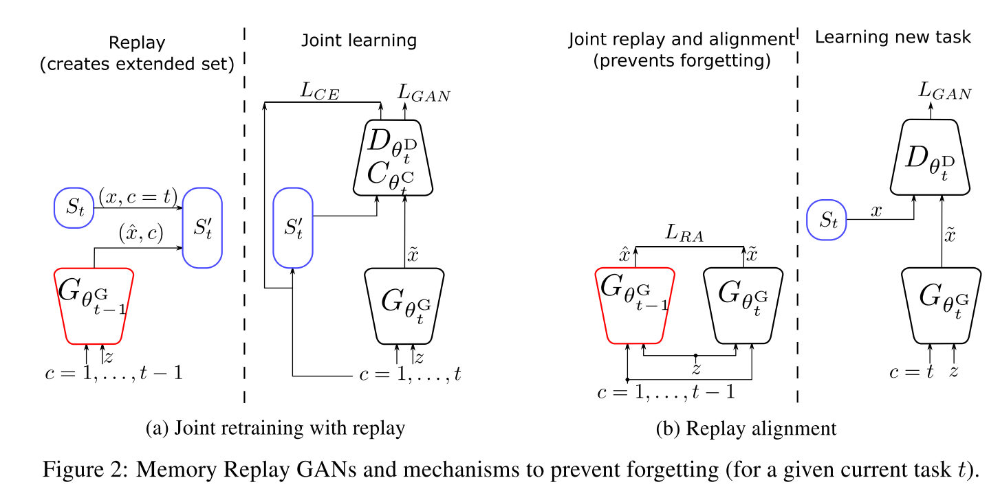
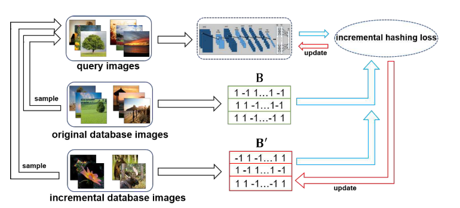

# Paper Reading on Incremental Learning

## 1. Memory Replay GANs: learning to generate images from new categories without forgetting

Wu, C., Herranz, L., Liu, X., Wang, Y., Van De Weijer, J., & Raducanu, B. (2018). Memory replay Gans: Learning to generate images from new categories without forgetting. Advances in Neural Information Processing Systems, 2018-December(NeurIPS), 5962–5972.

### 1.1 Abstract

> Previous works on sequential learning address the problem of forgetting in discriminative models. In this paper we consider the case of generative models. In particular, we investigate generative adversarial networks (GANs) in the task of learning new categories in a sequential fashion. We first show that sequential fine tuning renders the network unable to properly generate images from previous categories (i.e. forgetting). Addressing this problem, we propose Memory Replay GANs (MeRGANs), a conditional GAN framework that integrates a memory replay generator. We study two methods to prevent forgetting by leveraging these replays, namely joint training with replay and replay alignment. Qualitative and quantitative experimental results in MNIST, SVHN and LSUN datasets show that our memory replay approach can generate competitive images while significantly mitigating the forgetting of previous categories.

顺序学习的先前工作解决了判别模型中的遗忘问题。在本文中，我们考虑生成模型的情况。特别是，我们研究生成式对抗网络以顺序的方式学习新类别的任务。我们首先揭示顺序微调使网络无法正确地生成先前的类别图像（即，遗忘）。为了解决这个问题，我们提出了Memory Replay GANs（MeRGANs），它是一个有条件的GAN框架，它集成了一个记忆重播生成器。我们研究了两种利用重播来防止遗忘的方法，即带重播的联合训练和重播对齐。在 MNIST，SVHN 和 LSUN 数据集中的定性和定量实验结果表明，我们的内存重播方法可以生成有竞争力的图像，同时显着减轻了先前类别的遗忘。

---

- 之前在顺序学习的工作解决了在判别模型的遗忘；本文考虑生成模型，特别是GAN。如果微调的话，无法生成之前类别的图像。提出集成了记忆重播生成器的条件GAN框架，即MeRGANs。研究了两种方式：带重播的联合训练；重播对齐。进行了MNIST、SVHN、LSUN上的定性/定量实验，结果表明记忆重播方法可以生成有竞争力的图像，同时明显减轻了之前类别的遗忘。

---

### 1.2 Introduction

GAN: 从低维隐空间到感兴趣的复杂分布，如自然图像。生成器与判别器间的对抗游戏；新结构，新loss

语义属性难以控制；条件GAN 使用语义条件作为输入，语义属性与固有多样性解藕。最简单的条件为类别标签，可以控制生成图像的标签。常规设置下，图像生成模型假设所有的训练数据在训练时可用。实践中这样的假设可能难以满足。现代神经网络要面对任务与数据预先不可知，需要在有新数据或任务时连续地更新模型。然而如果用顺序的方式更新神经网络，而不去重新访问之前的数据，神经网络会出现严重的退化，称为灾难性遗忘。防止遗忘的策略有对权重或激活层正则化、保留一小类的先前样本，或者记忆重播机制。

本文聚焦于生成模型尤其是GAN中的遗忘，通过生成类别以顺序方式展现且不交叉的图像。Seff et al. 的 Continual learning in generative adversarial nets 使用elastic weight，与本文较为相似。不过我们依赖于记忆重播，并介绍了两种方法，分别是联合重训练和对齐重播。前者在训练过程中包括重播的样本，后者强制将当前生成器的重放与辅助生成器生成的重放同步。所谓辅助生成器，是指学习新任务前保留的快照。

---

- GAN 实现低维到高维映射；方法基于生成器与判别器间的对抗博弈；目前在新结构与新损失上有提升
- GAN语义属性难以控制，条件GAN将语义条件作为输入，使语义性质与固有多样性解藕；最简单的条件是类别标签；
- 传统设定：训练时，训练数据全部可见；这在实践中可能不现实，可能的场景是任务和数据事先不可知，需要在有新的数据或任务时不断更新模型；顺序方式更新，不重新访问之前的数据，神经网络会退化。防止遗忘的方法：对权重或激活层正则化、保留一小类先前样本、记忆重播机制等。
- 本文场景：通过类别作为不相交的任务顺序出现，来考察生成模型的遗忘。[24]将EWC弹性权重固定的方法应用到GAN，与本文最类似。与之相比，本文方法依赖于记忆重播，并提出了联合重训练与重播对齐两种方法。前者在训练过程中包括重播样本，后者强制将当前生成器的重播与辅助生成器的生成图像同步。在图像生成中研究遗忘可以直观观察到遗忘的动态。

---

### 1.3 在GAN中顺序学习

先介绍非顺序设置下的条件GAN，所有类别联合学习。Baseline 基于AC-GAN框架，使用WGAN-GP作为loss。以类别标签作为条件，通过给定的类别来生成图像，$\hat{x} = G_{\theta^G}(z,x)$。使用条件BN(Conditional Batch Normalization)，就是BN层参数取决于类别c。隐变量对c完全不可知，相同的隐变量对不同的c可以生成不同类别的图像。判别器参数$\theta^D$，区分样本是否真实。分类器参数$\theta^C$，预测标签$\hat{c}=C_{\theta^C}(x)$。$\theta=(\theta^G,\theta^D,\theta^C)$。

网络通过解决对抗博弈与分类任务来训练，交替优化生成器，判别器与分类器。使用WGAN-GP作为loss。生成器优化目标为：

$$
\begin{aligned}
&\min_{\theta^G} \Big(L_{GAN}^G(\theta,S)+\lambda_{CLS}L_{CLS}^G(\theta,S)\Big)\\
& L_{GAN}^G(\theta,S)=-\mathbb{E}_{z\sim p_z,c\sim p_c} [D_{\theta^D}(G_{\theta^G}(z,c))] \\
& L_{CLS}^G(\theta,S)=-\mathbb{E}_{z\sim p_z,c\sim p_c} [y_c\log C_{\theta^C}(G_{\theta^G}(z,c))] \\
\end{aligned}
$$

$L_{GAN}^G(\theta,S)$是GAN的loss，$L_{CLS}^G(\theta,S)$是分类任务的交叉熵损失。$p_c=\mathcal{U}\{1,M\},p_z=\mathcal{N}(0,1)$，$y_c$是标签的one-hot编码。判别器与分类器的优化目标：

$$
\begin{aligned}
&\min_{\theta^D,\theta^C} \Big(L_{GAN}^D(\theta,S)+\lambda_{CLS}L_{CLS}^D(\theta,S)\Big)\\
& L_{GAN}^D(\theta,S)=-\mathbb{E}_{(x,c)\sim S} [D_{\theta^D}(x)]+\mathbb{E}_{z\sim p_z,c\sim p_c} [D_{\theta^D}(G_{\theta^G}(z,c))] + \lambda_{GP}\mathbb{E}_{x\sim S, z\sim p_z,c\sim p_c, \epsilon\sim p_{\epsilon}}\Big[(\lVert\nabla D_{\theta^D}(\epsilon x +(1-\epsilon)G_{\theta^G}(z,c))\rVert_2-1)^2\Big] \\
& L_{CLS}^D(\theta,S)=-\mathbb{E}_{(x,c)\sim S} [C_{\theta^C}(G_{\theta^G}(z,c))] \\
\end{aligned}
$$

$L_{GAN}^D$的最后一项是梯度惩罚。

现在我们修改之前的框架来解决顺序学习的场景。定义一个序列任务$T=(1,\dots,M)$，每一项对应从新的训练集$S_t$中学习去生成图像。简化任务，也就是$S_t$中只有特定标签$t=c$的图像。上面的联合训练问题可以使用到顺序学习场景中：

$$
\min_{\theta_t^G} L_{GAN}^G (\theta_t, S_t)
$$

$$
\min_{\theta_t^D} L_{GAN}^D (\theta_t, S_t)
$$

$\theta_t=(\theta_t^G,\theta_t^D)$，使用$\theta_t=\theta_{t-1}$来初始化。会产生灾难性遗忘。

通过弹性权重合并（EWC）防止遗忘：灾难性遗忘可以通过使用之前任务的样本来被减轻，或者不同类型的正则化，惩罚参数或激活上的较大变化。特别是，弹性权重合并正则，使用如下目标训练生成器：

$$
\min_{\theta_t^G} L_{GAN}^G (\theta_t, S_t) + \sum_i \frac{\lambda_{EWC}}{2}F_{t-1,i}\Big(\theta_{t,i}^G -\theta_{t-1,i}^G\Big)^2
$$

$F_{t-1,i}$是Fisher信息矩阵，反映参数$\theta_{t,i}^G$对遗忘的敏感度，$\lambda_{EWC}$是超参。Baseline方案。

### 1.4 记忆回放生成对抗网络

我们提出生成器通过重播之前任务的记忆（通过生成样本），并在当前任务的训练中使用它们来防止遗忘，而不是对参数正则。框架通过重播生成器来扩展，我们描述了两种方法来利用记忆重播。重播机制或者说伪排练，类似与海马体在记忆巩固过程中重播记忆的作用，被用在分类器中来防止遗忘，但目前还没有用在图像生成任务中。图像生成是一个生成任务，比分类更麻烦。

#### (1) 通过重播样本进行联合再训练 MeRGAN-JTR

第一个思路是利用记忆重播来产生扩充数据集$S'_t=S_c\bigcup_{c\in\{1,\dots,t-1\}}\tilde{S}_c$，包含当前任务的训练数据与之前任务的记忆重播。重播集$\tilde{S}_c$包含固定数量的给定标签的采样$\hat{x}=G_{\theta_{t-1}^G}(z,c)$。创建扩充数据集后，使用联合训练来训练网络：

$$
\min_{\theta_t^G} \Big(L_{GAN}^G(\theta_t,S_t')+\lambda_{CLS}L_{CLS}^G (\theta_t,S_t') \Big)
$$
$$
\min_{\theta_t^D} \Big(L_{GAN}^D(\theta_t,S_t')+\lambda_{CLS}L_{CLS}^D (\theta_t,S_t') \Big)
$$

Shin et al. 的 Continual learning with deep generative replay 中使用非条件的GAN，并通过分类器预测类别。而我们使用条件GAN，类别标签作为输入，对重播过程控制地更好，且对$(x,c)$对有更可信的采样，因为避免了潜在的分类错误及对近期类别的采样偏向。

#### (2) 重播对齐 MeRGAN-RA

当前生成器与重播生成器结构、输出、输入相同，而且，因为当前生成器是使用重播生成器的参数初始化的，条件空间、隐变量空间、参数空间也初始对齐。因此，我们可以通过同步重播生成器与当前生成器，通过对相同的隐变量和类别生成相同的图片。生成图像$\hat{x}$与$x$应该像素对齐，因此可以使用逐像素的loss来防止遗忘（如$L_2$）。

作为对比，这种情况下的判别器只使用当前任务的图像训练，且无分类任务。生成器的loss为

$$
\min_{\theta_t^G}L_{GAN}^G (\theta_t,S_t)+\lambda_{RA}L_{RA}(\theta_t,S_t)
$$
$$
L_{RA}(\theta_t,S_t)=\mathbb{E}_{x\sim S, z\sim p_z,c\sim \mathcal{U}\{1,t-1\}}\bigg[\lVert G_{\theta_t^G}(z,c)-G_{\theta_{t-1}^G}(z,c) \rVert^2\bigg]
$$

这种情况下，两个生成器都针对之前的任务进行记忆重播。

我们的方法可以被视为对齐蒸馏，蒸馏需要空间对齐的数据。可以与 Li et al. Learing without Forgetting 相联系，也有一些不同：

- 任务与数据。Li的是分类有类别标签的向量，我们是生成有结构的图像
- 空间对齐。相同类别，不同隐变量，会生成很多图像。
- 任务无关的输入与可见类别。Li中，当前分类任务的图像作为输入，提取输出特征来蒸馏。潜在引入域偏移，因为特定的输入图像总与不可见类别相联系，因此老任务的输出会有域偏移。但我们的方法不会出现，因为输出并不是真实图像，而是类别无关隐变量与两个生成器皆可见的类别标签。

### 1.5 实验结果

数字生成：

## 2. Deep Incremental Hashing Network for Efficient Image Retrieval

Wu, D., Dai, Q., Liu, J., Li, B., & Wang, W. (2019). Deep incremental hashing network for efficient image retrieval. Proceedings of the IEEE Computer Society Conference on Computer Vision and Pattern Recognition, 2019-June, 9061–9069.

### 2.1 Introduction

> Hashing has shown great potential in large-scale image retrieval due to its storage and computation efficiency, especially the recent deep supervised hashing methods. To achieve promising performance, deep supervised hashing methods require a large amount of training data from different classes. However, when images of new categories emerge, existing deep hashing methods have to retrain the CNN model and generate hash codes for all the database images again, which is impractical for large-scale retrieval system. In this paper, we propose a novel deep hashing framework, called Deep Incremental Hashing Network (DIHN), for learning hash codes in an incremental manner. DIHN learns the hash codes for the new coming images directly while keeping the old ones unchanged. Simultaneously, a deep hash function for query set is learned by preserving the similarities between training points. Extensive experiments on two widely-used image retrieval benchmarks demonstrate that the proposed DIHN framework can significantly decrease the training time while keeping state-of-the-art retrieval accuracy.

散列因其存储和计算效率而在大规模图像检索中显示出巨大潜力，尤其是最近的深度监督散列方法。为了获得有希望的性能，深度监督的哈希方法需要来自不同类的大量训练数据。但是，当出现新类别的图像时，现有的深度哈希方法必须重新训练CNN模型并再次为所有数据库图像生成哈希码，这对于大规模检索系统是不切实际的。在本文中，我们提出了一种新颖的深度哈希框架，称为深度增量哈希网络（DIHN），用于以增量方式学习哈希码。 DIHN直接学习新图像的哈希码，同时保持旧图像不变。同时，通过保留训练点之间的相似性来学习用于查询集的深度哈希函数。在两个广泛使用的图像检索基准上进行的大量实验表明，提出的DIHN框架可以显着减少训练时间，同时保持最新的检索精度。

- Learning to hash: 将图片等多媒体资源编码为短二进制哈希码
  - 可以减少内存和计算消耗
  - 深度哈希方法: 将深度神经网络结合到哈希码的学习中
    - 由于传统方法，如局部敏感哈希(LSH)、谱哈希(SH)、迭代量化(Iterative Quantization)
  - 目前最优的深度哈希方法：利用CNN获取图像的底层语义结构
    - 同时学习特征表示与哈希函数，充分利用预训练的CNN
    - 方法有：单标签图像哈希、多标签图像哈希
  - 图像检索：如何更新模型；图像语义概念更新很快，但即时模型不总是及时可用
    - 有新概念添加时，需要使用原始图像和新增图像重新训练模型；还需要使用新模型重新生成全部图像的哈希码
- 本文提出新方法，可以增量学习，DIHN，深度增量哈希网络
  - 给定增量图像，查询图像，原始图像哈希码，同时对查询图像的哈希函数和增量图像的哈希码进行学习；使用DCNN作为query的哈希函数，而增量图像的哈希码直接学习得到；异步设计，使原始图像哈希码保持不变；设计了模型训练的增量哈希损失函数，相似性保留
  - 提出第一个增量哈希DIHN，学习新类别哈希码，保持原类别不变
  - 设计了模型训练的增量哈希损失函数，通过训练图像间的相似性保留；利用已有哈希码训练query的哈希函数，同时增量图像的哈希码直接在优化中得到
  - 实验

- 相关工作
  - 深度哈希学习：
    - CNNH，NINH，DRSCH
    - oneline hash：需要更新全部数据集的哈希码
    - 很难更新模型；
    - DIHN采用非对称方法，把非对称作为保持原始哈希码不变的方式
  - 增量学习：在新训练数据上扩展已有模型的知识
    - 解决训练消耗与数据可利用性问题

### 2.2 深度增量哈希网络 DIHN

#### 2.2.1 问题定义

- 数据集 $D = \{d_i\}^m_{i=1}$，类别标签 $L = \{L_1, L_2, L_c\}$，每个图片都有标签
- 学习到的哈希码 $B=\{b_i\}^m_{i=1}\in \{-1,+1\}^{k\times m}$，$k$为哈希码长
- 新数据集 $D' = \{d_i\}^{m+n}_{i=m+1}$，新类别标签 $L_j' \in L' = \{L'_1, L'_2, L'_{c'}\}(1\leq j \leq c')$
- 目标：对新类别学习新的哈希码$B'=\{b_i\}^{m+n}_{i=m+1}\in \{-1,+1\}^{k\times n}$，同时保持原有类别哈希码不变
- 学习CNN作为哈希函数，对新类别和旧类别图像均可输出哈希码，监督信息为 $S\in \{-1,+1\}^{(m+n)\times q}$，这个矩阵表示query中图片与$D$、$D'$的相似度

#### 2.2.2 整体框架

- 输入：原始图片集，增量图片集，查询图片
  - query 从$D$、$D'$采用得到
- 两部分：哈希函数学习；增量哈希码学习
  - 哈希函数学习：利用DCNN提取query的特征表示，再学习深度哈希函数来输出哈希码$B_Q$；对query进行
  - 增量学习：学习$D'$的哈希码$B'$
- 提出增量哈希loss函数，保持query与数据库图片的相似；已给定的哈希码保持不变

#### 2.2.3 深度哈希函数

CNN模型最后的FC层输出为哈希码长度$k$，定义为

$$
b_{Q_i} = h(a_i;\theta) = \mathrm{sign}(f(a_i;\theta))
$$

其中$\theta$表示模型参数，$f(\cdot)$为最后FC的输出。

#### 2.2.4 增量哈希Loss

- 保持训练点间的语义相似性
  - 标签为 $S\in \{-1,+1\}^{(m+n)\times q}$，目标是降低/增大相似/不相似对的码字的汉明距离，使用$L_2$损失减小码字的内积与相似性的差值

$$
\begin{aligned}
\min_{B',B_Q}& J(B',B_Q) = \sum_{i=1}^m \sum_{j=1}^q (b_i^Tb_{Q_j} - kS_{ij})^2 + \sum_{i=m+1}^{m+n} \sum_{j=1}^q (b_i^Tb_{Q_j} - kS_{ij})^2 \\
 s.t. & B' = \{b_{m+1}, \dots, b_{m+n}\} \in \{-1, +1\}^{k\times n}\} \\
  & B_Q = \{b_{Q_1}, \dots, b_{Q_q}\} \in \{-1, +1\}^{k\times q}\}
\end{aligned}
$$

- 深度哈希函数带入上述loss，得

$$
\begin{aligned}
\min_{B',\theta}& J(B',\theta) = \sum_{i=1}^m \sum_{j=1}^q (b_i^T\mathrm{sign}(f(a_j;\theta)) - kS_{ij})^2 + \sum_{i=m+1}^{m+n} \sum_{j=1}^q (b_i^T\mathrm{sign}(f(a_j;\theta)) - kS_{ij})^2 \\
 s.t. & B' = \{b_{m+1}, \dots, b_{m+n}\} \in \{-1, +1\}^{k\times n}\} \\
\end{aligned}
$$

- 这个loss 是NP难的，因为有$\mathrm{sign}(\cdot)$，可以改成$\mathrm{tanh}(\cdot)$作为宽松表示
- 设原始图像库的索引为$\Psi=\{1,2,\cdots,m\}$，增量图像索引为$\Phi=\{m+1, \cdots, m+n\}$；query中来自$D$、$D'$的索引分别为 $\psi=\{i_1, \cdots,i_{q^*}\}$与 $\phi=\{j_1, \cdots,j_{q'}\}$，且query数量$q=q'+q^*$，loss可写为

$$
\begin{aligned}
\min_{B',\theta}& J(B',\theta) = \sum_{i\in \Psi} \sum_{j\in \psi \cup \phi} (b_i^T\mathrm{tanh}(f(d_j;\theta)) - kS_{ij})^2 + \sum_{i\in \Phi} \sum_{j\in \psi \cup \phi} (b_i^T\mathrm{tanh}(f(d_j;\theta)) - kS_{ij})^2 \\
&+ \lambda \sum_{j\in \psi \cup \phi} (b_j-\tanh(f(d_j;\theta)))^2 + \mu \sum_{j\in \psi \cup \phi} (\tanh(f(d_j;\theta))^T \mathbb{1} )^2\\
 s.t. & B' = \{b_i|i\in\Phi\} \in \{-1, +1\}^{k\times n}\} \\
\end{aligned}
$$

- 添加了两个正则项，第一个希望减小学习到的哈希表示与函数生成的哈希函数的距离；第二个希望对比特位置进行平衡，-1与+1均衡出现在哈希码中

#### 2.2.5 优化

迭代方法学习 $\theta$与$B'$

- $\theta$ 步
  - 保持 $B'$固定，反向传播优化CNN模型参数

- $B'$步：并不直接
  - 保持$\theta$固定，重写loss

$$
\begin{aligned}
\min_{B'} J(B')& = \lVert B'^TU -kS \rVert^2_F + \lambda \lVert B'_{\phi} - U_{\phi} \rVert^2_F\\
&=\lVert B'^TU\rVert^2_F - 2k\mathrm{tr}(B'SU^T) - 2\lambda \mathrm{tr} (B'_\phi U_\phi^T) + const,\\
s.t. \; &B' = \{b_i|i\in\Phi\}\in\{-1,1\}^{k\times n}
\end{aligned}
$$

- 其中，$S=\{-1,1\}^{n\times q}$，query与$D'$的相似矩阵；$U = \{u_i|i\in \psi \cup \phi\} \in \{-1,1\}^{k\times q}$、$U_\phi = \{u_i|i\in \phi\} \in \{-1,1\}^{k\times q'}$，为query及$D'$中query的宽松二进制表示；$B'_\phi=\{b_i|i\in\phi\}\in\{-1,1\}^{k\times q'}$表示$D'$的二进制哈希码
- 进一步简化上式，定义$\tilde{U} = \{\tilde{u}_i|i\in \phi\}\in \{-1,+1\}^{k\times q'}$，其中

$$
\tilde{u}_i = \begin{cases}
    u_i, \; i\in\phi,\\
    0, \; otherwise
\end{cases}
$$

- 使用离散循环坐标下降，每次更新$B'$的一行，最终推导的迭代公式为$B'_{l*}=-\mathrm{sign}(2\hat{B}'^T_l\hat{U}_lU^T_{l*}+P^T_{l*})$
- 原始的哈希码可以使用ADSH等方法
- 复杂度为$\mathcal{O}(m+n)$与$\mathcal{O}(n)$

### 2.3 实验

在CIFAR-10与NUS-WIDE数据集上进行了实验。