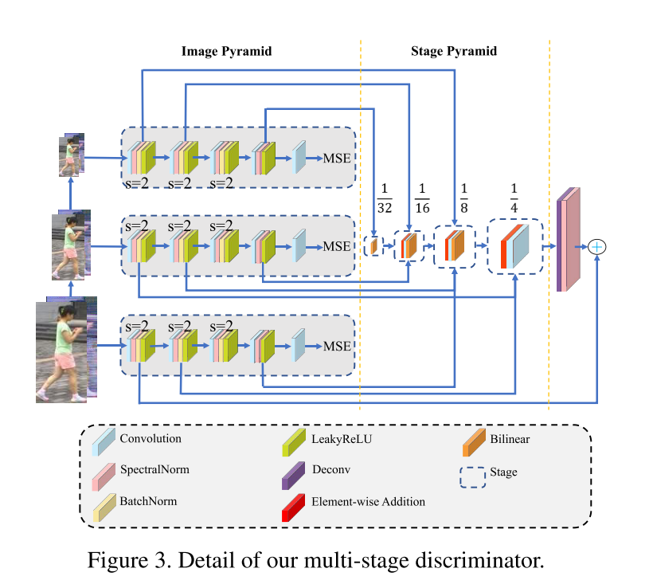

# Paper Reading on Person Re-Idnetification

## 1. Deep Learning for Person Re-identification: A Survey and Outlook

### 1.1 Introduction

- Person re-ID
  - person detection
  - person tracking
  - person retrieval
- Most important: how to correctly match, under appearance changes including lighting, pose & viewpoint

### 1.2 Image-based

- closed-world: $G=\{g_i\}_{i=1}^N$，$i^* = \argmax_{i\in 1,2,\cdots,N}sim(q,g_i)$

#### 1.2.1 Hand-crafted Systems

- image description & distance metrics
- Pedestrian Description
  - color: weighted color histogram, maximally stable color regions, RHSP
  - attribute-based features: mid-level
- Distance metric learning
  - Supervised learning v.s unsupervised learning; global learning v.s local learning
  - Supervised global metric learning
    - keep vectors of same class closer, pushing vectors of different classes further
    - Mahalanobis Distance $d(x_i,x_j)=(x_i-x_j)^TM(x_i-x_j)$
    - KISSME: pairwise difference $x_{i,j}=x_i-x_j$, assume to Gaussian distribution
    - Large margin nearest neightbor Learning, LMNN
      - set up a perimeter, punish invadors
      - Information-theoretic metric learning, avoid overfitting
  - Learning discriminative subspaces: subspace projection
    - $\mathcal{J}(w) = \frac{w^TS_bw}{w^TS_ww}$
    - $S_b,S_w$ are between-class & with-class scatter matrices
  - SVM or boosting

#### 1.2.2 Deeply-learned Systems

## 2. Deep Learning for Person Re-identification: A Survey and Outlook

### 2.1 Introduction

- Re-id 致力于在多个非覆盖的摄像头中检索感兴趣的人。
- Query：图像，视频序列，文字描述
- 公共安全需求、监控摄像的增长；在智能视频监控系统设计中很重要
- 挑战性：视角变化，低分辨率，光照变化，无约束的姿态，人潮拥挤，异质形态
- 早期关注手工特征构建，依赖于身体结构或距离度量
- 本文特点
  - 对现存深度学习方法深度分析，讨论优势与局限
  - 设计AGW基线方法（sota）与评估指标mINP（发现所有正确匹配的cost）
  - 讨论几个重要的研究方向，研究开放问题，试图缩小封闭世界与开放世界间的差距
- 主要步骤
  - 原始数据搜集
  - 生成Bounding box；一般使用person detection或tracking 算法生成
  - 训练数据标注
  - 模型训练：大量模型解决各种挑战，包括特征表示学习，距离度量学习，及其组合
  - 行人检索：测试阶段，给定感兴趣人与画廊集，提取特征表示，使用person2gallary相似度生成检索排序表；有方法研究排序算法提升检索性能
- 开放世界与封闭世界设置
  - 单模态与异质数据：开放世界应用，摄像头使用不同光谱、梗概图、深度图、文字描述，异质ReID
  - Bounding box与原始数据：实际应用需要从原始数据中端到端搜索：端到端ReID
  - 标注数据与未标注数据：开放世界场景没有大量标注数据，甚至没有标签信息：无监督/半监督ReID
  - 正确标注与噪声标注：标注错误与不完美的检测/跟踪：噪声鲁棒的Re-ID
  - 画廊查找与开放集：查询可能不存在于画廊集中：开放集ReID

### 2.2 封闭世界行人ReID

- 封闭世界设置
  - 单模态摄像；行人使用BBox表示；足够标注的训练数据；标注基本正确；查询出现在画廊集中
- 三个组件：
  - 特征表示学习；特征构建策略
  - 深度度量学习；使用不同的损失函数或采样方法设计训练目标
  - 排序优化；优化检索排序列表

#### 2.2.1 特征表示学习

- 全局特征：对每个行人图像提取全局特征向量
  - Wu 设计 PersonNet 以提取细粒度线索，使用小的卷积核提取
  - Wang 开发了单一图像表示SIR与跨图像表示CIR组成的联合框架，使用带有特定子网的三元损失进行训练
  - ID判别嵌入模型，将ReID的训练过程看做是多类分类，每个人作为单独的类，目前被社区广泛使用
  - Qian 开发多尺度深度表示学习模型，捕获不同尺度的判别线索，自适应地挖掘适合检索的尺度
  - 人体语义解析技术，捕获像素级别的判别线索，增强姿态变化的鲁棒性
  - 注意力信息：注意力机制被广泛研究来增强表示学习
    - 行人图像内部的注意力：
      - HA-CNN，和谐注意力CNN联合学习软的像素注意力与硬的区域注意力，增强错误对齐的鲁棒性；
      - FAB，全注意力块纠正逐通道特征反应，可以被应用到不同的CNN架构提升判别力；
      - KPM，克氏积匹配，通过软弯曲机制对齐特征图，多级特征学习，自残差注意力；
      - BraidNet 通过设计卷积结果对齐特征图；
      - 在空间与通道注意力上引入自我批判强化学习
      - MGCAM，Mask引导的对比注意力模型，减小背景混杂的影响，使用区域级的三元损失训练
    - 跨行人图像的注意力
      - 上下文感知的注意力特征学习方法，结合序列内与序列间注意力，实现成对特征对齐与优化，因为学习策略不依赖于时间信息，基于图像的ReID中的多个图像也可以表述为序列
      - 带有注意力一致性的并联网络
      - 组相似性结合了多个图像，使用同一的条件随机场框架，对图像级别的局部与全局相似性建模，从而学习特征
  - 结构调整
    - SVDNet，奇异向量分解，利用正交约束强化全局特征表示学习
    - 使用简单结构标准网络，将多个层的嵌入聚合为一个嵌入，增强最终表示
    - 类激活图增强网络，扩展激活范围，探索多分支网络的富视觉线索
- 局部特征：学习部分/区域聚合特征，对对齐错误鲁棒；通过人体姿势估计或大致水平划分生成身体部分；趋势是混合全身表示与局部部分特征
  - Cheng 设计了一个多通道部分聚合的DCNN，结合局部身体部分特征与全局全身特征到一个三元训练框架中
  - MSCAN，多尺度上下文感知网络，通过堆叠多尺度卷积，从身体部分中捕获局部上下文知识
  - 多阶段特征分解与选择性树结构融合框架，捕获大的与小的身体特征
  - Zhao 分解身体到局部区域，再进行部分级别的匹配
  - 两流网络，分别提取全局外观与局部身体部分特征映射；使用双线性池化层聚合两个流得到增加表示
  - 部分级别特征学习对背景的鲁棒性
    - PDC，姿态驱动的深度卷积模型，利用人体部分线索进行鲁棒表示学习，解决姿态的变化问题
    - 注意力感知的组成网络，姿态引导的部分注意力模块，屏蔽不想要的背景特征；注意力感知的特征组合模块，聚合部分级别的特征
  - 特定部分注意力设计
  - Siamese LSTM，自适应聚合水平区域特征，使得空间依赖性挖掘与上下文信息传播增强了聚合区域特征的判别力
  - PCB，基于强部分的卷积基线，统一分区策略通过多个分类器来学习部分特征；通过精细的部分池化策略，部分内一致性得到增强；强部分特征学习基线为目前的sota
  - 第一组利用人体解析技术获取语义上有意义的身体部分，提供了对齐良好的部分特征，但需要额外的姿态检测器，且由于数据集的局限容易产生噪声；第二组使用统一分组获取水平条部分，灵活但对较大的人流与背景噪声敏感
- 辅助特征：额外标注信息，如语义特性；生成/增广训练样本增强特征表示
  - 语义特性：
    - 联合身份与特性；
    - 引入预测的语义特性信息，半监督增强特征表示的泛化性能与鲁棒性；
    - 挖掘全局与局部图像语言关联，约束视觉与语言特征的一致性，提升视觉特征表示
  - 视角信息：通过世界融合特征学习，提取视角不变身份表示
  - 域信息：将每个摄像机作为不同的域，提出多摄像机一致性匹配约束，获取全局最优表示
  - 生成与增广：
    - 使用GAN，Zheng 通过生成的行人图像提升监督特征表示学习；利用姿态约束提升生成图像的质量；姿态归一化的图像生成，增强姿态变化的鲁棒性；引入摄像机风格信息到图像生成，解决图像跨摄像机变化问题；联合判别与生成学习模型，分别学习外观与结构编码，提升生成质量；无监督域迁移
    - 数据增广提升监督，未见测试样本的泛化性：生成不懂光照下的虚拟人物渲染；随机擦除增加随机噪声；随机丢下特征图中的区域块，强化注意力特征学习
  - 将画廊图像作为辅助信息：相似度引导的图卷积网络SGGNN，训练阶段引入探针画廊相似度，增强泛化；约束聚类方案，利用支配集，提升探针画廊测量，强化鲁棒性
- 视频特征
  - 基于视频的ReID，每个人由一段视频表示，带有富外观与时间信息；带来对视频特征表示学习的挑战
  - Zheng 表明非约束跟踪序列中时间信息不可靠；
  - 引入循环神经网络，LSTM，捕获时间信息
  - 视频序列通常含有离群点，时间注意力模型；时间空间注意力池化网络，ASTPN
  - 视频长度不固定，将长视频分割为多个短视频，聚合排序高的，学习联合嵌入
  - 利用多个视频帧自动补全拥堵区域，时空补全网络，利用从未拥堵部分补全拥堵部分，增强对拥堵的鲁棒性
- 结构设计
  - 多数使用图像分类网络作为骨干，如ResNet50，变化有改变最后一个卷积层的大小为1，最后的池化层使用自适应avg池化，在池化层后添加带有BN的瓶颈层
  - ...

### 2.2.2 度量学习

- 学习马氏距离函数或映射矩阵
- 损失函数设计，指导特征表示学习
- 损失函数设计
  - 身份损失：图像分类
    - $L_{id}=-\frac{1}{n}\sum_{i=1}^n \log (p(y_i|x_i))$
  - 验证损失：
    - 对比损失 $L_{con} = (1-\delta_{ij})\{\max(0, \rho-d_{ij})\}^2 + \delta_{ij}d^2_{ij}$
    - 验证损失 $L_{veri}(i,j) = -\delta_{ij}\log(p(\delta_{ij}|f_{ij})) - (1-\delta_{ij})\log(1-p(\delta_{ij}|f_{ij}))$
- 训练策略

## 3. Transferable, Controllable, and Inconspicuous Adversarial Attacks on Person Re-identification With Deep Mis-Ranking

Wang, H., Wang, G., Li, Y., Zhang, D., & Lin, L. (2020). Transferable, Controllable, and Inconspicuous Adversarial Attacks on Person Re-identification With Deep Mis-Ranking. Retrieved from [link](http://arxiv.org/abs/2004.04199)

### 3.1 Introduction

- 行人重识别：跨摄像头匹配行人
  - DNN用于ReID的判别特征与自适应距离度量
  - 对抗攻击：使用对抗样本误导系统
  - 天然的对抗扰动：行人带包、帽子、眼镜
    - 犯罪嫌疑人利用对抗扰动欺骗视频监控
  - 研究ReID的对抗样本，可以确认弱点，提升鲁棒性
    - 哪些身体部位最易被对抗攻击？对这些部位增加注意力
    - 使用对抗训练提升ReID系统
  - 真实世界为开放集合：查询可能不在库中
    - 排序问题而非分类问题；目前对分类、分割、检测、人脸识别的攻击不适合排序问题
    - 图像域因时间域摄像头不同而变化，需考虑跨数据集黑盒攻击；目前对抗攻击方法迁移性较差
    - 关注不显眼的攻击来检查ReID的安全性
- 设计可迁移、可控制、不明显的攻击
  - 提出学习错误排序 learning-to-mis-rank 方法，扰乱ReID模型的排序预测
    - 设计mis-ranking loss，攻击潜在匹配的排序；是目前基于错误分类攻击的补充
  - 提升攻击者的可迁移性：Transferable
    - 提高攻击者的表示学习能力，以提取对抗扰动的一般特征
    - 多阶段网络结构，通过学习判别器不同级别的特征进行表示学习
    - 对复杂ReID系统迁移性很好
    - 白盒与黑盒攻击联合解决方案
  - 让攻击不显眼：Inconspicuous
    - 目标像素的数目可控，使用可微分多次采样；
      - 对抗攻击可以看做搜索目标像素集合进行噪声污染；
      - 为了让像素搜索空间连续，将对一个像素的选择放宽到所有可能像素的Gumbel softmax
      - 目标像素的数量由softmax的输出的动态阈值控制，因此可控
    - 设计新的感知loss，提升攻击图像的视觉质量，保证不可感知
  - 在Market1501，CUHK03，DukeMTMC、MSMT17上进行实验
    - 最好结果：91.8 to 1.4
    - 可解释的攻击分析，提升ReID系统鲁棒性与安全性
- 相关工作
  - Person ReID
    - 与分类不同；分类中训练集与测试卷共享类别，而ReID中训练集与测试集没有覆盖
    - deep ranking
    - 使用结构信息解决对齐问题
    - Zhang 引入最短路径损失监督局部部位对齐，在度量学习中采用共有学习方法，超越了人类性能
    - 无监督：使用GANs
  - 对抗攻击
    - Goodfellow 提出使用每个像素的梯度的符号生成对抗样本，缺乏泛化性
    - DeepFool 可以欺骗深度分类器，同样缺乏泛化性
    - 无法控制被攻击的像素的数量
    - 目前未被引入排序问题，且迁移性差
    - 不关注视觉质量的不显著性
    - 限制了在openset 上的应用

### 3.2 方法

- 对每个输入图像 $\mathcal{I}$，使用生成器 $\mathcal{G}$产生欺骗性的噪声 $\mathcal{P}$
- 通过将 $\mathcal{P}$添加到 $\mathcal{I}$上，得到对抗样本 $\mathcal{\hat{I}}$，可以欺骗ReID系统 $\mathcal{T}$输出错误结果
- ReID系统 $\mathcal{T}$认为不相似的图像对匹配，相似的图像对不匹配
- 通过GAN训练，生成器 $\mathcal{G}$，判别器 $\mathcal{D}$

#### 3.2.1 Learning-to-Mis-Rank

- 使用 L2MR 扰乱系统输出的排序
  - 最小化不匹配对的距离，最大化匹配对的距离
- $\displaystyle{\mathcal{L}_{adv\_etri} = \sum_{k=1}^K\sum_{c=1}^{C_k} \Big[ \max_{\begin{subarray}{c} j\neq k \\ j=1\cdots K \\ c_d=1\cdots C_j \end{subarray}} \lVert\mathcal{T}(\hat{\mathcal{I}}_c^k) - \mathcal{T}(\hat{\mathcal{I}}_{c_d}^j) \rVert_2^2 - \min_{c_s=1\cdots C_k} \lVert \mathcal{T}(\hat{\mathcal{I}}_c^k) - \mathcal{T}(\hat{\mathcal{I}}_{c_s}^j) \rVert_2^2 + \Delta \Big]}$
  - 上式中，$C_k$为第k个ID的样本数量，$\mathcal{I}_c^k$为第k个ID的第c个图像，$c_s,c_d$分别为相同ID与不同ID的样本
  - 此公式使用三元损失攻击深度排序，不同ID最易判别的（即距离最大）距离被鼓励变小，相同ID最易判别的（即距离最小）距离被鼓励变大
- 此loss有很多优势
  - 很适合ReID问题；ReID的训练集与测试集没有覆盖
  - 适合所有的openset问题；使用此loss利于学习通用可迁移特征

#### 3.2.2 为攻击学习可迁移特征

- 对抗样本是特征而非bug
- 增强攻击者的迁移性，需要提升攻击者的表示学习能力，为对抗扰动提取更通用的噪声
- 通过生成器 $\mathcal{G}$，判别器 $\mathcal{D}$进行表示学习
  - 生成器 $\mathcal{G}$使用ResNet50
  - 判别器 $\mathcal{D}$
    - 很多文章使用cross-layer信息来确认对抗样本
    - 本文提出新的多阶段网络结构，金字塔结构，利用判别器不同级的特征增强表示学习
    - 由三个全卷积子网构成，每个子网有五个卷积层，三个降采样层，以及多个归一化层
    - 分别接收原始图像、1/4、1/16大小的图像作为输入；相同大小的特征图合并到相同的stage
    - 判别器的最终的反应图为$\lambda$，用来选择加噪声的概率

#### 3.2.3 控制攻击像素的数量

- 对抗攻击即将一组噪声叠加到一组目标像素上，噪声与像素均未知
- 让搜索空间连续，将对一个像素的搜索放松到所有可能像素上
  - $\displaystyle{p_{i,j} = \frac{\exp(\log(\lambda_{i,j} + \mathcal{N}_{i,j})/\tau)}{\sum_{i,j=1}^{H,W} \exp(\log(\lambda_{i,j} + \mathcal{N}_{i,j}) /\tau) } }$
  - $i,j$表示像素的索引，此像素被选择的概率$p_{i,j}$为$\lambda_{i,j}$的softmax输出，$\mathcal{N}_{i,j}$为Gumbel分布，$\tau$为温度参数，逐渐减为0来软化均匀分布到分类分布的转移
  - 被攻击的目标像素的数量由mask $\mathcal{M}$ 控制
  - $\displaystyle{\mathcal{M}_{i,j} = \begin{cases} KeepTopk(p_{i,j}), \;& \mathrm{when \;forward}\\ \ p_{i,j}, \; &\mathrm{when \;backward}\end{cases}}$
  - 前传与反传的区别保证了可微性
  - 将$\mathcal{M}$与生成器生成的噪声$\mathcal{P}'$相乘，得到最终的噪声$\mathcal{P}$
- 通过这种方式，自动选择将一些明显的噪声去除？？
  - $\lambda$由判别器子网的特征图组合得到，越大表示对特征图的激活大，也就是对判断有没有加噪声这一结果的影响大；最大的k个结果选出来作为最终的噪声像素

#### 3.2.4 视觉质量的感知损失

- 控制攻击像素的数量保证扰动不明显；关注视觉质量
- 过往工作忽视了这一点；MS-SSIM
- $\displaystyle{ \mathcal{L}_{VP}(\mathcal{I},\hat{\mathcal{I}}) = [l_L(\mathcal{I},\hat{\mathcal{I}})]^{\alpha_L}\cdot \prod_{j=1}^L [c_j(\mathcal{I},\hat{\mathcal{I}})]^{\beta_j}[s_j(\mathcal{I},\hat{\mathcal{I}})]^{\gamma_j}}$
- $c_j,s_j$为对比度比较与结构比较，$L$为尺度的级别，$\alpha_L,\beta_j,\gamma_j$为对每个部分进行重新加权的因子
- 使用这个损失，可以实现在较大的攻击的情况下，不被人类察觉

#### 3.2.5 目标函数

- 错误分类损失，放宽对非目标攻击
  - $\displaystyle{\mathcal{L}_{adv\_xent} = -\sum_{k=1}^K \mathcal{S}(\mathcal{T}(\hat{\mathcal{I}}))_k ((1-\delta)\mathbb{I}_{\argmin \mathcal{T}(\mathcal{I})_k} + \delta v_k)}$
  - $\mathcal{S}$为log-softmax，$K$为ID的数量，$v$为平滑正则
  - 也就是说，ReID系统的输出先过对数softmax，再与一个向量相乘，这个向量真实类别的位置为0，其他位置为$\frac{\delta}{K-1}$，ReID距离最小的位置为$1-\delta$；相当于将ReID系统输出的最优结果对应的损失变大
  - 加入此损失后，提升了训练的稳定性与攻击成功率
- GAN损失
  - 生成器通过输入图像产生欺骗性噪声，判别器尽量分辨是否是对抗样本
  - $\displaystyle{\mathcal{L}_{GAN} = \mathbb{E}_{I_{cd}, I_{cs}}[\log \mathcal{D}_{1,2,3}(I_{cd},I_{cs})] + \mathbb{E}_{\mathcal{I}}[\log(1-\mathcal{D}_{1,2,3}(\mathcal{I}, \hat{\mathcal{I}}))] }$
- 最终的损失为
  - $\mathcal{L} = \mathcal{L}_{GAN} +\mathcal{L}_{adv\_xent} + \xi\mathcal{L}_{adv\_etri}+\eta(1-\mathcal{L}_{VP})$

### 3.3 实验

- 采用mAP与rank1,5,10,20准确率进行测试；越低表示攻击的效果越好
- 进行了白盒攻击、黑盒攻击以及消融实验
