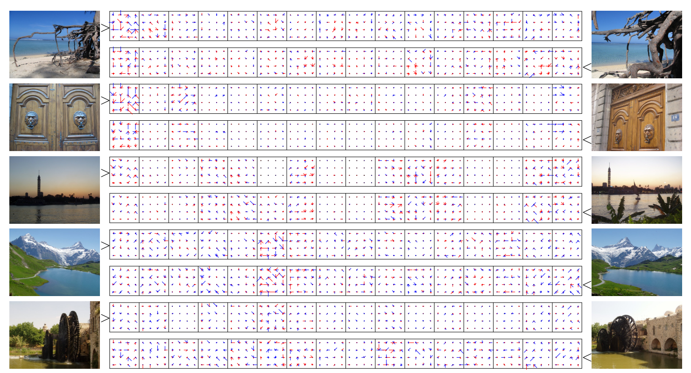
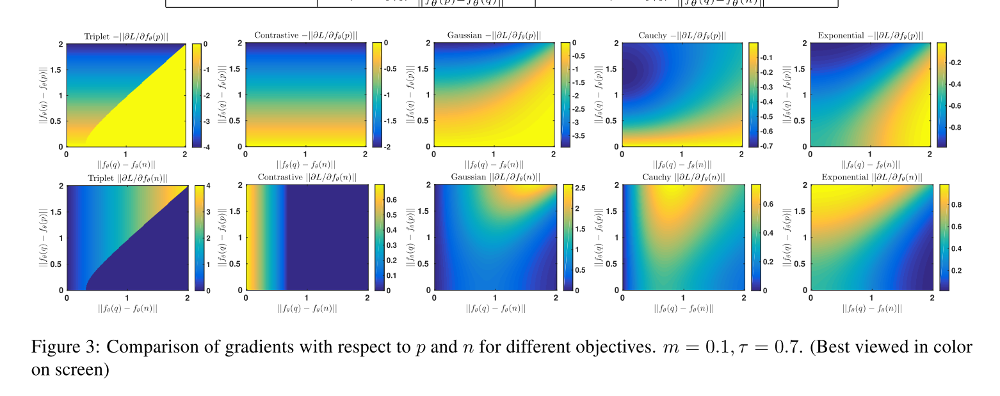
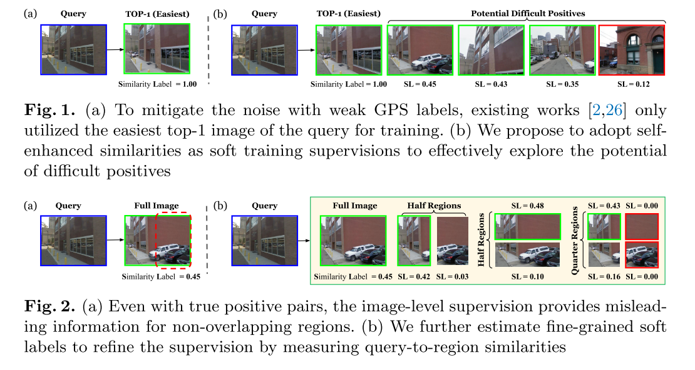

# Paper Reading on Image Retrieval

## 0. 一些基础

### 0.1 SIFT特征

Lowe, D.G.: Distinctive image features from scale-invariant keypoints. International journal of computer vision 60(2), 91{110 (2004)

- 尺度不变特征转换，Scale-invariant feature transform
  - 图像的局部特征，其对旋转、尺度缩放、亮度变化保持不变性，对视角变化、仿射变换、噪声也保持一定程度的稳定性；
  - 独特性（Distinctiveness）好，信息量丰富，适用于在海量特征数据库中进行快速、准确的匹配；
  - 多量性，即使少数的几个物体也可以产生大量的SIFT特征向量；
  - 高速性，经优化的SIFT匹配算法甚至可以达到实时的要求；
  - 可扩展性，可以很方便的与其他形式的特征向量进行联合。
- 特征点：角点、边缘点、亮区暗点、暗区亮点
- 高斯模糊：与高斯核卷积
- 尺度空间：
  - 构建高斯金字塔，分层降采样为不同尺度，每个尺度与不同尺度的高斯函数卷积，尺度内再分层
  - 高斯差分 -> 高斯拉普拉斯（DOG，Difference of Guassian）
  - 极值点检测：与同层相邻八个点及上下层对应的18个点，共26个点比较
  - 参数：$\sigma(o,s) = \sigma_0 2^{o+s/S}$，$O,S$为组数与组内层数，通过此公式计算尺度坐标
    - $\sigma$为高斯的标准差，也称为尺度空间因子，越大平滑越多；大尺度为概貌特征，小尺度为细节特征
    - 可以看到，金字塔层越低，即图像越大，尺度空间因子就越小，即底层为细节特征；反之，高层图片降采样后变小，同时$\sigma$更大，为概貌特征，与直觉一致
- 关键点定位
  - 离散关键点有偏移，插值精确定位
  - 检测边缘响应，并剔除
- 关键点方向匹配：通过邻域窗口内像素的梯度计算
  - 360度划分为36个方向，计算邻域内梯度最多的方向为主方向
  - 峰值大于主方向峰值80%的方向为辅方向
  - 此时有位置、尺度、方向的关键点即为SIFT特征点
- 关键点特征描述
  - 选取关键点邻域，划分为子区域；旋转坐标系为关键点的方向
  - 计算子区域八个方向的梯度大小
  - 各区域八个方向梯度大小组合起来即为特征向量；再归一化；截断较大梯度值再归一化
  - 按尺度排序

### 0.2 Fisher Kernel

Perronnin, F., Liu, Y., Sanchez, J., Poirier, H.: Large-scale image retrieval with compressed sher vectors. In: 2010 IEEE Computer Society Conference on Computer Vision and Pattern Recognition. pp. 3384{3391. IEEE (2010)

- 用生成式模型（GMM）对样本输入建模，进而得到样本的一种表示（Fisher Vector），再将这种表示输入判别式分类器（SVM）得到图像分类结果
- Fisher Vector：特征表示，将一幅图片表示成一个向量
  - 分类器：$S_{new} = sign(\sum_i S_i\lambda K(X_i,X_{new}))$
  - 核函数：$K(X_i,X_{new}) = \phi^T_{X_i}\phi_{X_j}$
  - 这里$\phi_X$为fisher kernel中样本表示方法，即为fisher vector
  - $\phi_X = F_\lambda^{-\frac{1}{2}}U_x$
  - 其中$U_x = \nabla_\lambda \log p(X|\lambda)$，$X$为特征几何，$\lambda = \{w_i,\mu_i,\Sigma_i\}$为GMM模型参数
  - $F_\lambda$为归一化参数，$F_\lambda = E_x(U_xU_x^T)$
- 计算fisher vector
  - $L(X|\lambda) = \log p(X|\lambda) = \sum_{t=1}^T \log p(x_t|\lambda)$
  - $p(x_t|\lambda) = \sum_{i=1}^N w_i p_i(x_t|\lambda)$
  - $p_i(x|\lambda) = \frac{1}{(2\pi)^{D/2}|\Sigma_i|^\frac{1}{2}}\exp (-\frac{1}{2}(x-\mu_i)^T \Sigma_i^{-1}(x-\mu_i))$
  - 定于特征$x_t$由第$i$个高斯分量生成的概率$\gamma_t(i) = p(i|x_t,\lambda) = \frac{w_ip_i(x_t|\lambda)}{\sum_{j=1}^Nw_j p_j(x_t|\lambda)}$
  - 求导得 $U_x = [\frac{\partial L(X|\lambda)}{\partial w_i}, \frac{\partial L(X|\lambda)}{\partial \mu_i^d}, \frac{\partial L(X|\lambda)}{\partial \sigma_i^d}]^T, i=1,\cdots,N$
- 对原图像特征升维，挖掘出更丰富的信息；fisher vector包含原特征每一维的值，且包含了生成式建模过程的结构信息，对图片的表达更加细致

### 0.3 PQ乘积量化

- 空间切分：向量维度切分
- 量化：每个子空间分别量化
- 压缩：码本规模$k_s^m$
- 距离计算
  - 对称计算：查询与库均量化
  - 非对称计算：库量化，查询不量化，精度更高
- IVFADC：PQ联合倒排索引
- 改进
  - OPQ
  - Multi-ADC
  - DPQ
  - AQ/APQ
  - TQ
  - LOPQ

### 0.4 VLAD特征

Jégou, H., Douze, M., Schmid, C., & Pérez, P. (2010). Aggregating local descriptors into a compact image representation. Proceedings of the IEEE Computer Society Conference on Computer Vision and Pattern Recognition, 3304–3311. [link](https://doi.org/10.1109/CVPR.2010.5540039)

解决了大规模图像搜索的问题，其中必须共同考虑三个约束：搜索的准确性，其效率以及表示的内存使用情况。首先提出一种简单而有效的方法，将本地图像描述符聚合到一个有限维的向量中，这可以看作是Fisher核表示的简化。 然后，我们展示了如何共同优化降维和索引算法，从而最好地保留了矢量比较的质量。 评估显示，我们的方法明显优于现有技术：对于20个字节的图像表示，搜索准确性与功能袋方法相当。 搜索一千万个图像数据集大约需要50毫秒。

- BoF在数据量大时，由于单词本大小限制，特征损失增多，搜索精度降低
- VLAD优化
  - 优化特征表示，使用VLAD特征
  - 对降维方法改进（PCA）
  - 对索引方法改进（ADC）
- 贡献
  - 基于BoF与Fisher vector 这两种聚合local特征的方法提出了VLAD特征
  - 对降维方法和索引方法做优化，寻找到trade-off的平衡值
- VLAD：vector of locally aggregated descriptors
  - 提取VLAD特征，$v_{i,j} = \sum_{x \;for\;NN(x)=c_i} x_j - c_{i,j},\;v = v/||v||_2$
  - 其中$x$为图像的特征点，$c_i$为该图像特征点聚类后的中心，$NN(x)$为离$x$最近的聚类中心，相当于一个Voronoi单元的残差和？
  - $v$的大小为$D=k*d$
  - 下图为$k=16$的情况，VLAD或者说SIFT特征的维度为$128$，对应一个小方格，$4*4*8=128$，表示距离单元内所有点与聚类中心的差再求和

  - VLAD比较稀疏，大部分差值接近0，且值常再一个簇里，比较结构化；利用此特性，可以降维 
- 降维与索引
  - 给定$D$维输入向量，希望得到一个$B$比特的图像表示编码，使得一个非编码的查询向量在$n$长的数据库向量中的最近邻可以被高效检索；通过测量每个步骤的MSE来表明联合优化的重要性
  - 近似最近邻
    - 欧氏局部敏感哈希：内存消耗大
    - 乘积量化：优于哈希方法
    - 使用非对称距离计算：只编码库中向量，不编码查询向量
      - 为获得好的特征表示：量化中心取很大，$k=2^{64}$，难以计算
      - 乘积量化：将$x$划分为大小为$D/m$的$m$个向量$x^1,x^2,\cdots,x^m$，再量化$q(x) = (q_1(x^1), q_2(x^2), \cdots, q_m(x^m))$，每个量化器量化为$k_s$个，那总量化就为$k_s^m$个
      - 距离$||x-q(y_i)||^2 = \sum_j ||x^j - q_j(y_i^j)||^2$，搜索前使用查找表计算$x^j$到$k_s$个中心的距离，复杂度为$O(D\times k_s) << O(D\times n)$
  - 索引感知的降维
    - PCA：$x' = Mx$，$M$大小为$D'\times D$，为协方差矩阵最大特征值对应的特征向量构成的正交矩阵，而$x_p = M^TMx$使用伪逆计算回去，误差为$x_p = x-\epsilon_p(x)$
    - PCA+量化：使用乘积量化，$q(x')$代替$x$，那么误差为$q(x_p) = x-\epsilon_p(x) - \epsilon_q(x_p)$
    - 因为PCA后前面维度的方差大，因此其乘积量化更粗糙，误差大
      - 方差平衡：$X''=QX'=QMX$，$Q=I-2vv^T$Householder矩阵
  - 量化索引

### 0.5 局部敏感哈希

- $(R,cR, P_1, P_2)$-sensitive
  - 如果$d(x,y)\leq R$，则$h(x)=h(y)$的概率不小于$P_1$
  - 如果$d(x,y)\geq cR$，则$h(x)=h(y)$的概率不大于$P_2$
  - 其中$c>1,P_1>P_2$
- 核心问题
  - 高维向量相似性的度量
  - 哈希函数的选择

## 1. SIFT Meets CNN: A Decade Survey of Instance Retrieval

图像检索任务跨越十年的探索历程

Zheng, L., Yang, Y., & Tian, Q. (2018). SIFT Meets CNN: A Decade Survey of Instance Retrieval. IEEE Transactions on Pattern Analysis and Machine Intelligence, 40(5), 1224–1244. [link](https://doi.org/10.1109/TPAMI.2017.2709749)

### 1.1 Introduction

- 考虑实例级检索（instance）
  - 2000年以前：传统方法，全局描述子，光照、形变、遮挡、裁剪下表现差
  - 2003年开始：词袋模型（BoW）结合SIFT方法
  - 2012年以来：CNN方法
- SIFT方法大多依赖词袋模型
  - 词袋模型：NLP方法，累加单词响应到一个全局向量，建立单词直方图，文档建模
  - SIFT默认为128维（4x4x8），预训练字典，再对特征量化，这样局部特征就类似于单词，再使用词袋模型
- 局部描述子：SIFT特征
  - 字典规模大：倒排索引，储存友好的签名方法；码本的生成与编码使用近邻方法
  - 中：BOW，倒排索引，二进制签名；准确率与效率
  - 小：紧凑编码向量
- CNN 图像表示
  - 预训练模型
  - 微调模型：端到端
  - 混合模型：图像块多次输入CNN，编码与索引类似于SIFT-based

### 1.2 SIFT-based

#### 1.2.1 Pipeline

- 局部特征提取。$N$张图片的画廊$\mathcal{G}$，$\{f_i\}_{i=1}^D, f_i\in\mathbb{R}$表示图像中$D$个被检测的区域的局部描述子
- 编码本的训练。线下训练码本。码本中的每个视觉单词位于一个子空间的中心，也称为Voronoi单元。更大的码本对应于更精细的划分，产生更具判别性的视觉单词，反之亦然。假设从无标签数据中训练出局部描述子$\mathcal{F} = \{f_i\}_{i=1}^M$，基准方法如k-means将$M$各点划分为$K$个簇，得到由$K$个视觉单词构成的长度为$K$的码本
- 特征编码。局部描述子$f_i\in \mathbb{R}^p$通过特征编码过程$f_i\rightarrow g_i$映射为嵌入特征$g_i\in\mathbb{R}^l$。使用k-means聚类，$f_i$通过到视觉单词的距离来编码。对大型码本可以使用硬量化和软量化方法。前者的嵌入特征只有一个非零元，而后者将$f_i$量化为少量的视觉单词。局部特征的嵌入的总和就是全局的签名。中型码本，可以生成额外的二进制签名来保持原始信息。小型码本大多使用局部聚合描述子向量（VLAD）、Fisher vector这样的流行的编码方案。
  - BOF：k-means 聚类，聚类中心代替特征点，损失信息
  - FV：GMM 建模，考虑特征点到每个聚类中心的距离，线性组合表示特征点
  - VLAD：两者结合，考虑距离最近的聚类中心，保存到最近的聚类中心的距离；考虑特征点每一维的值，图像局部信息刻画更细致

#### 1.2.2 局部特征提取

- 局部不变特征针对精准匹配图像的局部结构而提出。基于SIFT的方法和大多数特征提取的步骤类似，由特征检测器与描述器构成。
- 局部检测器。
  - 感兴趣点检测器致力于在多变的图像场景中定位出一系列特征稳定的局部区域。检索社区中，寻找图像的仿射协变区域一直是首选。检测区域的形状随仿射而变化，描述符则可以保持不变。此种检测器与以关键点为中心的海森矩阵矩阵检测器不同，也和关注尺度不变区域的检测器如DoG不同（差分高斯）。
  - 仿射检测器检测适合于局部强度图案的椭圆区域。这确保相同局部结构因视角变化产生形变时也能被检测到。最大稳定极值区域（MSER）检测器与仿射扩展的海尔拉普拉斯检测器（affine-extended Harris-Laplace）为仿射不变的区域检测器。
  - 海森仿射检测器（Hessian-affine）在检索中广泛使用，因其在视角变化问题中的优异性能，一般认为其优于DoG。
  - 重力假设方法：仿射不变区域方向模糊；抛弃方向估计，建筑物数据集上一致性提升
  - 非仿射检测器：拉普拉斯-高斯（LoG）、Harris 检测器
  - 表面光滑：使用物体边缘
  - 密集区域检测器
- 局部描述子：编码局部内容
  - SIFT：默认描述子；128维
    - PCA-SIFT：降到36维，加速匹配，不过特征计算量增加，特征区分度降低
    - RootSIFT：SIFT $l_1$ 归一化再开平方；惯用方法
  - SURF：使用海森拉普拉斯检测器，局部梯度直方图；使用积分图加速特征计算
    - 与SIFT可比的准确率，更快的计算速度
  - 二进制描述符：汉明距离替代欧式距离，加快匹配速度
  - 学习式方案：提高特征符区分度

#### 1.2.3 小码本检索

- 视觉单词数量为几百到几千，码本生成与编码的复杂度不高；代表性工作：BoW、VLAD、FV
- 码本生成：
  - 聚类复杂度取决于码本大小，VLAD 与 FV 中码本大小一般为64，128，256
  - VLAD：平面k-means算法
  - FV：高斯混合模型GMM；使用最大似然估计训练$u_\lambda(x) = \sum_{i=1}^K w_iu_i(x)$，$K$为高斯混合曲线的数目
    - GMM 使用$K$个高斯分布的混合来描述特征空间，可以写为$\lambda = \{w_i, \mu_i, \Sigma_i, i=1,\cdots,K\}$，分别表示高斯分布$u_i$的权重，均值向量，协方差矩阵
- 编码：码本小，可以使用复杂与信息保持的方法
  - FV：
    - 预训练GMM模型，FV描述局部特征与GMM中心间的平均一阶与二阶偏差，维度为 $2pK$，$p$局部描述子维度，$K$码本大小
    - 指数归一化，防止突发性问题（burstiness）：进行非线性变换$x_i = sign(x_i) ||x_i||^\alpha$，然后$l_2$归一化
    - 各方面提升：
      - 用每个描述符的空间坐标与相关的可调权重进行扩充
      - 生成更大的码本（4096），提升精度，不过运算量更大
      - 提出非iid模型，抑制突发事件的影响，改进指数归一化效果
  - VLAD：FV的简化版本
    - 将局部特征量化为最近的视觉单词，记录距离；使用最近邻搜索（NNS）
    - 总和池化残差向量，再归一化；维度为$pK$
    - 各种提升：
      - PCA与白化（$PCA_w$），使视觉单词共现去相关（de-correlate co-occurrences）；训练多个码本，减少量化损失
      - All about VLAD
        - 归一化每个粗糙聚类的残差和，称为内部归一化
        - 词汇自适应，解决数据集迁移问题
        - multi-VLAD ，解决小目标发现
      - 归一化每个残差向量而不是残差和；再每个Voronoi单元内进行PCA降维
      - 使用软任务和经验性地为每个rank学习最优权重；而非硬量化
  - 一些通用技术提升了各种嵌入的思路，包括VLAD，FV，BoW，局部约束线性码（locality-constrained linear code，LLC）及单项嵌入
    - 为提升嵌入的区分能力，提出结合SIFT描述符，用方向协变嵌入的方法对SIFT特征主方向编码；弱几何一致性，几何线索，与主方向相似的匹配点被加权，反之亦然
    - 三角嵌入法，只考虑输入向量的方向，不考虑大小；限制映射向量间干扰的民主聚合法
    - 广义最大池化法，GMP，均衡池化向量与每个编码表示间的相似性来优化
  - 复杂度
    - BoW，VLAD、FV复杂度相似；忽略线下训练与SIFT提取
    - VLAD与FV，视觉单词分配，需要计算与每个视觉单词的距离，复杂度为$O(pK)$；其他步骤复杂度不超过这一步
    - 总和池化，编码过程复杂度为$O(pKD)$，$D$为一个图中特征的数量
    - 三角嵌入复杂度类似；multi-VLAD复杂度为$O(pKD)$，匹配过程更耗时
    - 层次VLAD复杂度为$O(pKK'D)$，$K'$为二阶码表的大小
    - 特征聚合步骤，GMP复杂度为$O(P^2/K)$，$P$为特征嵌入的维度
- 近似最近邻搜索，ANN Search
  - VLAD/FV 嵌入的维度高，使用高效的压缩与ANN方法
  - PCA降维，甚至可能提升精度
  - 基于hash的ANN，使用标准二进制编码，如局部敏感hash（locality sensitive hashing）或谱hash
  - 使用SIFT与GIST特征数据集进行测试时，谱哈希不如乘积量化PQ
  - 基于量化的ANN，PQ优于其他ANN如FLANN
  - 对聚类中心排序，邻近的中心汉明距离小，与基于汉明距离的ANN兼容，提升了PQ的速度
  - 新的ANN技术：group testing，将数据库分组，每组由组向量表示；比较query与组向量，计算组内是否包含匹配；组向量显著少于数据库向量，缩短检索时间；Iscen 提出直接找出数据库中最优组向量，不需精确分组，减少了内存消耗

#### 1.2.4 大码本检索

- 包括1百万视觉单词，或者更多；一些步骤与小码本方法有差异
- 码本生成
  - 近似方法，将数据分配到大量簇中。
  - 层次k-means（HKM）
    - 分层进行标准k-means；先划分为很少数量的簇（$\bar{k} << K$），再递归地将每个簇分为更多的簇
    - 每次递归每个点都要被分到某个簇中，簇的深度为$O(\log K)$，$K$为目标簇数量
    - 计算复杂度为$O(\bar{k}M\log K)$，$M$为训练样本数量；$K$很大时，显著小于扁平k-means的复杂度$O(MK)$
  - 近似k-means（AKM）
    - 使用随机$k$-d树对$K$个簇中心进行索引，因此分配步骤很有效地使用ANN，分配复杂度为$O(K\log K+vM\log K)=O(vM\log K)$，$v$为$k$-d树要访问的最近簇的候选数
    - 复杂度与HKM相当，量化误差小于HKM
    - 基于AKM的算法中，默认使用FLANN进行ANN
- 特征编码，量化：与码本聚类相互交错，ANN对两者都很重要
  - AKM与HKM可以用在聚类与编码中；大码本，关键要平衡量化误差与计算复杂度；不使用FV、稀疏编码等方法，因其复杂度过高
  - 如何保证量化效率同时减小量化误差？
  - 沿着分层树结构量化局部特征；不同层的量化树节点权重不同；由于高度不平衡的树结构，基于$k$-d树的方法优于此方法
  - 基于$k$-d树的方法：一个视觉单词分配给每个局部特征，使用从码本中构建的$k$-d树进行ANN搜索
  - Philbin 提升了这一硬量化方案，将特征量化到一些最近的视觉单词；每个被分配的视觉词的权重与距离的负相关，为$\exp(-d^2/2\sigma^2)$
  - Mikulik 提出通过无监督的匹配特征集为每个视觉单词找到相关的单词；这些备选词往往包含匹配特征的描述符
  - 为减少软量化的内存消耗和查询视觉词汇的数量，Cai 认为当局部特征离最近的视觉词很远时，该特征可以被丢弃，不会降低精度
  - 为进一步加速量化，标量量化提出在没有明确的训练码本的时候进行量化；浮点向量二值化，所得二值向量的第一维转化为十进制，作为视觉单词；高量化误差与低召回率的情况下，标量量化使用位翻转来为局部特征生成大量视觉单词
- 特征加权
  - TF-IDF。
    - 码本$C$中的视觉单词被分配指定权重，称为词频与反文档频率（term freq & inverse document freq，TF-IDF）。
    - TF定义为 $TF(c_i^j)=o_i^j$，$o_i^j$为视觉词汇$c_i$在文档$j$中出现的频率。TF为局部权重
    - IDF确定一个给定视觉单词对文档的贡献，公式为 $IDF(c_i) = \log \frac{N}{n_i}$，这里$n_i = \sum_{j\in G}\mathbb{I}(o_i^j > 0)$，$N$为画廊图像的数目，$n_i$为$c_i$出现在图像中的次数。
    - 图像$j$中词汇$c_i$的TF-IDF 权重为$w(c_i^j) = TF(c_i^j)IDF(c_i)$
  - 提升方案。
    - 突发性：图像中出现重复结构；主导图像相似度
      - jegou 提出TF变种解决突发性，如TF上进行平方运算
      - Revaud 提出检测不相关图像中的频繁出现的关键点组来降低评分函数的计算值
      - Shi 提出在在描述符阶段检测突发性；检测突发描述符经过平均池化送入BoW
      - ZHeng 提出$L_p-norm$IDF 方法解决突发情况
      - Murate设计了后来被并入BM25公式的指数IDF
      - Torii 将突发性视为结构上的显著特征，在突发性检测后进行新的相似性测量
    - 数据库端特征增强。两种方法在线下构建图像的图结构，通过图的边来表明两个图像共享相同的结构
      - 只保存通过几何验证的特征，降低了存储成本；基本图像的特征通过它所连接的所有视觉词汇来进行增广
      - 只添加那些被认为在增广图像中可见的视觉词汇，排除干扰性的视觉词汇
- 倒排索引。提高存储与检索性能；在大中型码本中使用
  - 一维结构。每一项对应于码本中的一个视觉词汇
  - 每个单词项对应于一个倒排表，每个倒排表中的索引称为索引特征或者记录；倒排索引发挥了大规模码本词汇直方图稀疏性的特点
  - 文献中新的检索方法需要使用倒排索引。基准方案中，图像ID与TF被保存在记录中；被整合进来的信息应足够小；如描述符上下文、描述符密度、方向等空间信息
  - 联合索引方案，当倒排索引随全局一致近邻增大时，语义孤立的图片会被删除来减小内存消耗
  - 倒排多索引方案，扩展为二维结构以进行ANN搜索，每个SIFT自向量学习一个码本；后来被改进融合局部颜色与SIFT。

#### 1.2.5 中型码本检索

- 10k到200k视觉词汇，中等区分能力，使用倒排索引
- 码本生成与量化
  - 计算量相对小，可以使用扁平k-means。AKM也可以取得很好地检索精度。
  - 量化，使用最近邻搜索找到最近的视觉词汇，实践表明使用严格的ANN算法得到有竞争力的检索精度；相关研究较少
- 汉明嵌入与提升
  - 补偿量化中的信息损失很重要，汉明嵌入（HE）是实践中的主流方法
  - Jegou 提出，HE极大地提升了中型码本的视觉词汇的区分能力。
  - 首先将SIFT描述子$f\in \mathbb{R}^p$映射到$p_b$维空间 $x = P\cdot f = (x_1,\cdots,x_{p_b})$，$P\in \mathbb{R}_b^p \times p$，为映射矩阵
  - 创建随机高斯矩阵，使用QR分解，矩阵$P$为得到的正交矩阵的前$p_b$行
  - 对于二进制$x$，使用落在每个Voronoi单元$c_i$中的低维向量计算中值向量$\overline{x_i} = (\overline{x_{1,i}}, \cdots, \overline{x_{p_b, i}})$
  - 给定描述符$f$与投影向量$x$，HE计算它的视觉单词$c_t$，公式为 $b_j(x) = 1\;if\; x_j > \overline{x_{j,t}}\;;0\;otherwise$
  - 二进制特征$b(x)$作为第二重校验；局部特征为同一个视觉词汇且HE的汉明距离小，认为它们是匹配的
  - HE应用于视频复制检测、图像分类、重排序中
  - 很多工作对HE提升，特别是匹配核的角度
    - 指数函数作用于汉明距离估计匹配强度
    - Jain 提出矢量二值距离比较法以减少查询的信息损失，利用向量到超平面距离，保持倒排索引的效率
    - Qin 提出高阶匹配核函数，通过错误匹配的距离分布自适应地标准化局部特征距离
    - Jegou 提出根据每个视觉单词的邻域分布，将词与词的距离归一化而非特征与特征的距离；一个词与其邻居间的平均距离几乎被归一化为恒定值
    - Tolias 表明VLAD和HE分析相似的性质，提出新的匹配核函数，在局部特征聚合与特征到特征的匹配之间进行折衷，使用与Qin类似的匹配函数；在HE中使用更多bit位精度更好

#### 1.2.6 其他问题

- 特征融合
  - 局部-局部特征融合
    - SIFT 只提供局部梯度描述，而没有其他判别信息
    - SIFT与颜色描述符耦合：部分解决不变性与判别能力的权衡问题
    - HSV-SIFT、HueSIFT：平移不变、尺度不变
    - OpponentSIFT：使用SIFT描述对立颜色空间的所有通道，对轻微颜色变化很鲁棒
    - 二进制颜色签名
    - 照明的密集变化有损颜色特征检索的有效性
  - 局部-全局特征融合
    - 局部与全局特征从不同的方面描述图像，可以互为补充
    - 前期融合：AlexNet或FC8这样的全局特征挖掘图像邻域关系，融合到基于SIFT的倒排索引中
    - 后期融合：
      - 排序级：Zhang 为每种类型的特征建立离线图，在在线查询期间进行特征融合；Deng 添加弱监督锚协助图融合
      - 分数级融合：自动学习的类别的特定属性与预训练的类别级的信息相融合
      - Zheng 提出通过提取一些特征进行查询自适应的后期融合，并以查询自适应的方式加权
- 几何匹配
  - BoW 模型缺乏对局部特征的几何约束
  - RANSAC：全局空间验证方法；重复计算每个对应的仿射变换，通过适合变换的内点数来验证
  - 如何高效准确地结合空间线索？
  - 局部特征的空间上下文：视觉短语；估计和整合全图中的视觉词汇共现；视觉词汇在局部邻域中的聚类；通过邻近图像块、随机空间分割、局部稳定区域（MSER）构建视觉短语
  - 投票机制检查几何一致性：投票空间内值更大的容器更能表示一个转换
    - 弱几何一致性（WGC），关注匹配特征在尺度与方向上的差异；不同空间量化到容器内
    - Hough 投票：定位在尺度或方向上相似或相异的子集
    - Zhang 提出使用x,y的偏移，具有目标评议不变心，对尺度与旋转变化敏感
    - Shen 在一些变换后量化了查询域的角度和尺度，缺点是查询时间与内存消耗增加
    - 霍夫金字塔匹配（HPM），通过分层划分变换空间来分配匹配结果，从而实现高效的投票方法并减轻量化损失
- 查询扩展
  - 后处理步骤，QE可提高查询精度。采用原始排名列表排在前面的图像进行新的查询，获得新的列表；可增加额外的判别特征到原始查询中
  - 实例检索中，Chum 最先使用，提出平均查询扩展AQE，用排名靠前的图像的平均特征发起新的查询
  - 空间验证用于重排序与使用平均池化获得的局部特征的感兴趣区域的获取
  - 改进：从学习背景的混淆、查询区域的扩展与增加空间验证的角度
  - 使用最靠前与最靠后的样本分别作为正负样本，在线训练SVM；学习到的权重向量用于计算平均查询
  - 其他QE的扩展：基于互惠邻居的 hello neighbor 算法、基于排序的权重QE、汉明QE
- 小目标检索
  - 检索图像中一小部分目标，具有挑战性：局部特征少；背景噪声大；TRECVID 中的实例搜索任、logo 检索任务
  - 基于关键点：局部特征间的空间上下文对区分目标很重要
  - 其他方法：突发性处理、考虑查询与目标间的不同内层比率
  - 有效的可能区域或多尺度图像块可以作为目标区域候选
  - 最近的sota：基于邻域图的区域扩散机制，提升小目标的召回

### 1.3 基于CNN的图像检索

近年来提出，替换了手工设计的局部特征。分为三类：预训练、微调、混合。前两类使用单一网络通过计算全局特征，后者需要多次网络通过。

#### 1.3.1 使用预训练CNN模型

- Single-pass，特征计算高效。其成功在于特征提取与编码步骤。先介绍预训练的常用数据集与网络，再介绍特征计算
- 流行的CNN架构：AlexNet，VGGNet，GoogleNet，ResNet
  - 卷积、池化、非线性
  - 感受野，滤波器
- 预训练数据集：ImageNet（1000类，120万张），Places-205（数量两倍，类别1/5，场景为主），混合数据集
- 迁移问题：
  - 检索任务，离原始数据集最远的目标；不同层特征表现出不同的检索性能，如AlexNet 的FC6，FC7，FC8在检索上的精度递减；使用适当的编码技术，pool5层优于fc6层
  - 原始训练集不同，模型准确率受影响；HybridNet 在进行PCA后取得最优的Holidays上的表现
  - 源与目标的相似度很重要
- 特征提取
  - 使用FC层作为描述子；FC有全局感受野，作为全局特征；在欧式距离下产生较好的检索精度，可以用指数归一化来提高
  - 中间局部特征；使用低层网络的卷积核用于检测局部视觉模式；感受野较小，密度作用于图像；对截断和遮挡更鲁棒
    - 局部描述子与中间局部特征紧密耦合；卷积后激活图层为特征的集成，列特征
    - 列特征可以看做对原始图像中某个图像块的描述，每个维度表示响应检测器的激活程度，类似与SIFT
    - 分好块的特征图上进行最大池化，再连接到所有滤波器上；多层列特征：超列特征
- 编码与池化：将一组描述符聚合为全局表示：编码或直接池化
  - 编码：一组列特征与SIFT类似，使用标准编码方案。VLAD或FV
    - BoW 编码也可以，每个层内的列特征聚集成一个BoW向量，然后跨层连接
    - 也有文章不实用固定长度表示，列特征量化为25k长的码本，使用倒排索引提升效率
  - 池化：CNN特征每个维度有明确含义，即特定区域的滤波器响应，直接池化可以产生具有区分度的特征
    - Tolias 提出最大激活卷积MAC，使用单个前向传递计算全局描述符；计算每个中间特征的最大值，并串联在一个卷积层中
    - 多区域版本使用积分图与近似最大算子快速计算，再归一化与PCA白化
    - 其他工作，在中间层特征映射上采用最大或平均池化；最后一个卷积层池化后准确度高于FC与其他卷积层
    - 池化前给每层特征图分配权重。目标对象往往出现在图像中心，于是加一个2D的高斯掩码
    - Xie 改进MAC表示法，将高层语义和空间上下文传播到低层，提高描述能力
    - Kalantidis 同时只需特征映射和通道加权，突出高激活的空间响应，减少突发的影响

#### 1.3.2 微调CNN

- 端到端生成图像级描述符，不需要额外的编码与合并
- 数据集：ImageNet，对同一类别的图像判别力不行
  - 微调数据集主要关注建筑物与一般物体。
  - Landmarks 数据集：672类，网络在Oxford5k、Holidays数据集上表现很好，在Ukbench上性能下降
  - Multi-view RGB-D 数据集：300个多角度拍摄的日常物品
  - 运动结构方法建立 3D Landmark 模型，线性判别投影优于白化方法
  - Tokyo Time Machine：谷歌街景
  - Product 数据集：家具，众包方法构建
- 网络：基于分类的网络，基于验证的网络
  - 基于分类：训练将建筑分为预定义的类别；训练集与查询无类重叠，AlexNet的fc6或fc7的嵌入用于基于欧式距离的检索；最后的fc层改为672个节点，与Landmark数据集类别一致
  - 基于验证：使用孪生网络（siamese），结合成对损失函数（pairwise）或三元损失函数（triplet）
    - 基于AlexNet的孪生网络与对比损失
    - Radenovic 使用MAC 层替换FC层
    - 建立3D模型挖掘训练对，基于3D点云选择正例图像，CNN描述符中距离较小的认为负例样本；输入孪生网络，使用$l_2$正则的MAC层输出计算对比损失
    - Gordo 在Landmark上微雕三元损失网络与区域提取网络；物体定位能力强，特征学习与提取中排除了图像背景
    - 微调模型在Landmark、Oxford5k、Paris6k、Holidays sota，在UkBench上泛化性能较好
    - NetVLAD在最后一个卷积层插入一个类似VLAD的编码层，通过反向传播进行训练；设计了新的三元损失函数利用弱监督的谷歌街景数据

#### 1.3.3 混合方法

- 输入图像生成多个图像块，输入网络进行特征提取，再编码或池化；类似于基于SIFT的方法
- 特征提取
  - 图像块检测
    - 网格化图像块：滑动窗口；先裁剪旋转再划分为不同尺度的图像块
    - 不变性关键点检测器：高斯特征点；MSER区域检测器
    - 区域提议方法：提供潜在对象的可能信息；选择性搜索策略；边缘盒方法；区域建议网络（RPN）
  - 描述符生成
    - CNN区域描述有效，除模糊图像优于SIFT；使用FC层或最大池化后的层作为特征
    - 基于手工检测器，可以使用有监督或无监督的方法进行CNN训练学习，提升了之前SIFT描述符学习的工作；Yi 在单个流程中端到端学习区域检测器、方向估计与特征描述符
- 特征编码与索引
  - 与基于SIFT方法类似，小码本：VLAD/FV，大码本：倒排索引
  - 图像块CNN特征的倒排索引：
    - 提取每个图像多个区域描述符进行多对多匹配，空间搜索：提高了对平移与尺度变化的鲁棒性
    - 在基于SIFT编码后建立CNN结构，在自然图像上训练分类模型，fc层特征可用于检索任务

#### 1.3.4 讨论

- 基于SIFT与基于CNN的关系
  - 混合方法为SIFT到CNN的过渡，只有特征提取不同
  - 单项CNN将SIFT与混合方法结合起来。预训练整合特征检测与描述；微调端到端，不需要编码
  - 固定长度表示效率高；通过聚集局部描述符、直接池化、端到端等方式获得；PCA等降维方法可以接在固定长度表示后，使用ANN如PQ或哈希进行快速检索
- 哈希与实例检索
  - 哈希是最近邻检索的主要方法；分为局部敏感哈希与哈希学习方法
  - LSH：与数据无关，性能不如基于学习的方法
  - 基于学习的哈希：分为量化与成对相似度保持
    - 成对相似度保持：手工设计哈希方法与谱哈希、LDA哈希
  - 使用DNN进行有监督哈希：输入原属图像，在二值化之前生成学习的特征
    - 关注分类级的检索任务，而非实例检索
    - 对于足够训练数据的实例检索，如建筑或行人，深度哈希方法可能重要

### 1.4 实验比较

#### 1.4.1 图像检索数据集

- Holidays：Jegou搜集，个人假日相册，各种各样场景；500组1491幅相似图像组成；每组有一个query，共500个query；手动旋转图像可以提升mAP
- UkBench：10200张不同内容的图像，如物体、场景和CD封面；分为2550组，每组四个图像为不同角度、光照、形变的同一物体，10200条查询记录
- Oxford5k 使用牛津的11个地名爬取5062张图片；每个地标五个查询，共55个查询；每个图像四个标签（good，OK，junk，bad）
- Flickr100k 99782张高清图片，添加到Oxford5k中测试检索算法的可扩展性
- Paris6k 6412张图片，11个巴黎建筑，每个地标5个查询，共55个查询；标签与Oxford5k类似
  - 评价标准：基于SIFT，被裁剪区域用于查询；基于CNN，一些使用全尺寸；一些进行裁剪，将裁剪图像输入CNN或者全图输入CNN再裁剪ROI内的特征

#### 1.4.2 评价指标

- 精准度-召回率
  - 召回：返回正确匹配数与数据库中全部正确匹配数之比
  - 精度：真实匹配占全部返回结果的比率
  - 返回$n$张，$n_p$张正确匹配，一共$N_p$张正确匹配，recall@n (r@n) 或 precision@n (p@n)分别为$n_p/N_p$与$n_p/n$
  - 给定一张待查的图像，可以根据 (r@1, p@1),(r@2,p@2),...,(r@N, p@N)绘制精度召回曲线
- AP 与 mAP
  - AP 计算 pr 曲线下的面积，AP 越大，检索性能越好
  - 通常有多个检索，它们的AP值求评价，即为mAP；Oxford5k，Paris5k，Holidays一般使用mAP
- N-S 分数
  - 用于UkBench数据集，等价于p@4和r@4，因为UkBench中每个查询有四个匹配

#### 1.4.3 比较分析

- 多年的性能改进
- 准确率比较
  - 中等码本与微调表现较好
- 效率比较
- 重要参数
- 讨论
  - 优先CNN：基于特定对象的检索（建筑物，人）；常见的对象检索或类检索
  - 基于SIFT：灰度图；颜色剧烈变化；小对象；对象严重遮挡；书籍/CD封面等丰富纹理的图像

### 1.5 未来方向

- 通用任务
  - 搜索引擎，通用检索
  - 引入大规模图像数据集；迫切需要大规模图像数据集，或以监督或无监督的方法生成数据集的方法
  - 设计新的CNN网络和学习策略；
- 专用任务
  - place retrieval, pedestrian retrieval, vehicle retrieval, logo retrieval
  - 特定先验知识
    - 行人检索，RNN可以连接身体部分的描述符
    - 车辆检索，特征学习期间可以推断视图信息；牌照信息
  - 训练数据收集
    - 通过谷歌街景收集不同地点的训练图像
    - 通过监控视频或互联网图像收集车辆图像
  - 特定数据集上探索新的学习策略和迁移学习的效果
  - 紧凑向量编码或短编码

## 2. All about VLAD

Arandjelovic, R., & Zisserman, A. (2013). All about VLAD. Proceedings of the IEEE Computer Society Conference on Computer Vision and Pattern Recognition, 1578–1585. [link](https://doi.org/10.1109/CVPR.2013.207)

### 2.1 Introduction

基于VLAD，做了三点贡献：

- Intra-normalization
  - 解决突发性问题，VLAD一些比较大的值不利于计算相似性
  - 简单改变归一化方法，提升了性能
- 提出词典适应性，解决了初始训练后新增图片的问题
  - 迁移性问题
- 多空间VLAD，MultiVLAD
  - 使用图片的一小部分进行检索
  - sub-VLAD

### 2.2 VLAD

- 归一化方法
  - 原始：L2归一化
  - 改进：有符号平方根SSR，$x_i\rightarrow sign(x_i)\sqrt{|x_i|}$
- 扩展
  - PCA 与白化，去相关低维表示
  - 多聚类降低量化损失
- 数据集
  - Oxford buildings 5k & 105k
  - Holidays & Flickr 1M
  - 单词表来源
    - Paris 6k
    - Flickr60k
    - Holidays前k个描述符

### 2.3 单词表适应

- 一个数据集上训练得到的词汇表，在另一个数据集上可能表现差
  - $\frac{1}{C^{(1)}}\sum_i (x_{k,i}^{(1)} - \,u_k)^T\frac{1}{C^{(2)}}\sum_i (x_{k,j}^{(2)} - \,u_k)$，聚类中心影响很大
  - 重聚类：耗费大，需要原始的SIFT描述子
  - 聚类中心适应：使用$\hat{\mu}_k$代替$\mu_k$
    - 使用数据集中所有被归于此类别的描述符的均值计算$\hat{\mu}_k$
    - 使用$\hat{\mu}_k$重新计算VLAD描述子

### 2.4 内归一化

- L2与SSR都对突发视觉特征给予了过多权重，导致次优的图片相似度测量
- 内部归一化方法：每个聚类中独立地归一化；之后整个向量再L2归一化

### 2.5 Multi-VLAD

- 使用14个VLAD表示一张图像
  - 3x3分割
  - 2x2分割
  - 全图
- 查询时，选择14个VLAD进行相似性度量，选择其中最大的
- 精细物体定位

## 3. NetVLAD: CNN architecture for weakly supervised place recognition

Arandjelovic, R., Gronat, P., Torii, A., Pajdla, T., & Sivic, J. (2018). NetVLAD: CNN Architecture for Weakly Supervised Place Recognition. IEEE Transactions on Pattern Analysis and Machine Intelligence, 40(6), 1437–1451. [link](https://doi.org/10.1109/TPAMI.2017.2711011)

### 3.1 Introduction

- 端到端训练的CNN架构，位置识别任务；主要架构NetVLAD，基于VLAD
- 提出训练步骤，基于新的弱监督排序损失，从Google街景图片中随时间推移的相同地点的图像中端到端学习参数
- 提出的方法，在位置识别基准上优于非学习的图像表示与现有的CNN描述子，且在标准图像检索中提升了目前sota的紧图像表示
- 如何识别相同的街角，在全市或全国范围内，不管拍照时的光照条件与外表的改变如何？
- 基本问题是，找到一个合适的表示，使得足够丰富以区别看企鹅来像的地方，又足够紧以至于可以表示全市或全国
- 实例检索任务
  - 查询库中最相似的图像
  - 数据库图像采用局部不变特征如SIFT，聚合到一个特征表示上如BoW、VLAD、FV
  - 对表示进行压缩与高效索引
  - 图像数据库使用3D结构进行增广，恢复相机姿态
- CNN
  - 表示能力，表示在识别任务上可迁移，但目标识别到实例识别的性能提升一般
  - 考虑直接通过地点识别训练CNN
    - 从中级卷积特征聚合为紧密的向量表示；设计可训练的泛化的VLAD层，NetVLAD，该层易于加入CNN结构，易于反向传播训练；使用PCA对聚合结果进行压缩
    - 从谷歌街景收集一个多视角全景图数据集；只有弱监督信息：根据有噪GPS，知道大致相同位置，不知道哪些部分相同
    - 开发端到端学习步骤，得到的表示对视角与光照的变化鲁棒，且关注外立面与天际线
- 相关工作
  - 大多数图像检索与地点识别工作不基于学习；
  - 基于学习的工作：没有端到端
    - 学习辅助任务，如局部特征；关注局部图像块的匹配，而非图像检索任务
    - 在手工描述子基础上学习；将CNN作为黑盒的特征提取器

### 3.2 方法

- Pipeline
  - 数据库有地理标记
  - 设计图像表示提取器$f$，线下计算数据库$\{I_i\}$的表示$\{f(I_i)\}$
  - 线上提取查询的表示$f(q)$，通过最近邻搜索或近似最近邻搜索$f(q)$与$f(I_i)$间的最小欧几里得距离$d(q,I_i)$
- 设计端到端可学习有参数的提取器$f_\theta$
  - 对于距离，也可以选择学习一个距离，本文直接使用欧式距离

### 3.3 结构

- 总体架构
  - 在最后一个卷积层裁剪CNN，对于$H\times W\times D$的输出，将其视为从$H\times W$个位置提取的$D$维的描述子
  - 设计新的聚合层，NetVLAD，将描述子映射到一个固定维度的表示中，其参数可学习
- NetVLAD
  - 将$N$个$D$维的描述子$\{x_i\}$视为输入，$K$个聚类中心$\{c_k\}$视为参数，输出表示为$K\times D$维的矩阵$V$，在归一化后转化为表示向量
  - $V(k,j) = \sum_{i=1}^N a_k(x_i)(x_i(j)-c_k(j))$，这里$a_k(x_i)$就是一个mask，$x_i$属于第$k$个视觉词，就取1，否则取0
  - 对$V$按行进行归一化，也就是内归一化，连接成一个向量后，再归一化
  - 为了让此层可反向传播训练，$a_k$必须可微，将$a_k$改造为连续
  - $\bar{a}_k(x_i) = \frac{\exp(-\alpha||x_i-c_k||^2)}{\sum_{k'}\exp(-\alpha||x_i-c_{k'}||^2)}$，其中$\alpha$为超参数，控制反应的延迟
  - 化简后，$\bar{a}_k(x_i) = \frac{\exp(w_k^Tx_i+b_k)}{\sum_{k'}\exp(w_{k'}^Tx_i+b_{k'})}$，其中，$w_k = 2\alpha c_k,b_k=-\alpha||c_k||^2$
  - 最终输出为$V(k,j) = \sum_{i=1}^N \frac{\exp(w_k^Tx_i+b_k)}{\sum_{k'}\exp(w_{k'}^Tx_i+b_{k'})}(x_i(j)-c_k(j))$
  - 其中$\{w_k\}, \{b_k\}, \{c_k\}$为可训练参数
  - 这里将$\{w_k\}, \{b_k\}$与$\{c_k\}$解耦，也就是All of VLAD中提出的数据集适应

### 3.4 弱监督学习

- 关键挑战
  - 如何收集足够有标注训练数据
  - 地点识别任务的合适损失是什么
- 从Google Street View Time Machine 中获取数据
  - 提供相同地点不同时间季节的图像
  - 只提供不完全有噪声的监督，GPS标签，大致定位，可以匹配附近的场景，无法确定部分的对应
  - 对于一个查询，GPS信息可以给出潜在的正样本$\{p_i^q\}$与确定的负样本$\{n_j^p\}$
- 弱监督三元排序损失
  - 我们希望$d(q,I_{i*}) < d(q,I_i)$，$I_{i*}$为查询的附近地点，而$I_i$为超过一定距离的所地点
  - 从数据集获取三元组$(q, \{p_i^q\}), \{n_j^p\})$
  - $p_{i*}^q = \argmin_{p_i^q} d_\theta(q, p_i^q)$，为潜在正样本中匹配查询的样本
  - 目标为学习表示$f_\theta$使得$d_\theta(q, p_{i*}^q) < d_\theta(q, n_j^q),\;\forall j$
  - 基于上述讨论，定义弱监督排序损失$L_\theta = \sum_j h(\min_i d_\theta^2(q, p_i^q) + m - d_\theta^2(q, n_j^q))$，其中$h(x) = \max(x,0)$
  - 这个loss为一系列负样本的loss的和，如果最小的正样本的距离比此负样本的距离大一个margin的话，就取为0；否则就加入损失中
- 使用SGD在数据集上训练

## 4. Stochastic Attraction-Repulsion Embedding for Large Scale Image Localization

Liu, L., Li, H., & Dai, Y. (2019). Stochastic attraction-repulsion embedding for large scale image localization. Proceedings of the IEEE International Conference on Computer Vision, 2019-Octob, 2570–2579. [link](https://doi.org/10.1109/ICCV.2019.00266)

### 4.1 Introduction

- 解决大规模基于图像定位问题；关键任务是学习有判别力的图像表示，该表示含有定位相关的信息
- 贡献
  - 将一个地点表示为一组样例图像，以求最大化地点间相似度，最小化地点内相似度
  - 将相似度测量建模为地点内与地点间表示的L2度量距离的概率分布
  - 提出随机吸引排斥嵌入（Stochastic Attraction and Repulsion Embedding, SARE）损失函数，最小化学习到的分布与实际分布的KL散度
  - 给出SARE、triplet ranking、contrastive losses的理论比较
- IBL任务分为两类
  - 基于图像检索
  - 基于2D-3D匹配
- 目前sota的IBL方法关注如何有效聚合CNN特征图以获得有判别力的图像表示，而忽略了如何有效地组织聚合的图像表示；
  - sota IBL 使用三元排序或对比嵌入对表示组织过程进行监督
- 本文提出高效组织图像表示的方法
  - 定义place为相同位置地标的图像集合，在嵌入空间直接优化place内相似度与place间的差异度
  - 目标是分离不同place的图像，聚类相同place的图像
- 直接作为多类别分类问题，监督数据不够；使用GPS标注的训练数据，同place内可能不是同一个landmark，可能导致不精确的定位
- 捕获同place图像的吸引力与place间图像的排斥力
  - 基于图像相似度的二分类：相同位置为1，否则为0
  - 使用查询、正样本、负样本三元组来进行训练
- SARE: Stochastic Attraction & Repulsion Embedding
- 相关工作
  - 大部分工作设计高效的CNN特征映射聚合方法，使用三元或对比嵌入目标，拉近匹配图像对的L2距离，拉远不匹配图像对的距离
  - 一些工作把IBL看做分类任务，使用交叉熵进行分类

### 4.2 方法

- 查询$q$，查到的图像正确定位，记为$p$，否则为$n$
- 流程
  - 使用CNN提取特征嵌入，$f_\theta(q)$
  - 定义相似度函数$S(\cdot)$，$S(f_\theta(p), f_\theta(q))$输出标量；应该简单，易于计算，可以快速最近邻搜索；通常使用L2距离
- 三元排序损失
  - $L_\theta(q,p,n) = \max(0, m + ||f_\theta(q) - f_\theta(p)||^2 - ||f_\theta(q) - f_\theta(n)||^2)$
  - $m$为基于经验的margin，通常取为0.1，使用$m$修剪掉$m + ||f_\theta(q) - f_\theta(p)||^2 <||f_\theta(q) - f_\theta(n)||^2$
  - 即足够远，不需要再反向传播了
- 对比损失
  - 对图像对$(i,j)$施加约束
  - $L_\theta(i,j) = \frac{1}{2}\eta||f_\theta(i) - f_\theta(j)||^2 + \frac{1}{2}(1-\eta)(\max(0, \tau - ||f_\theta(i) - f_\theta(j)||)^2)$
  - 对$q\sim p$图像对，$\eta=1$；对$q\sim n$图像对，$\eta=0$
  - $\tau$是经验margin，用于修剪掉$||f_\theta(i)-f_\theta(j)||>\tau$
  - 这个损失使得$q\sim p$对距离无限小，$q\sim n$对距离至少为$\tau$
- SARE
  - 三元组$q,p,n$定义了两个place，即$q\sim p$与$n$；使用概率框架定义相似度
  - 对于查询$q$，其选择$p$为匹配的概率为$h_{p|q} = 1$，而$h_{n|q} = 0$，定义$h_{q|q} = 0$，此三者确定了一个概率分布
  - 定义嵌入空间的概率分布$c_{q|q}, c_{p|q}, c_{n|q}$，尝试减小这两个分布间的不匹配
  - $L_\theta(q,p,n) = h_{p|q}\log \frac{h_{p|q}}{c_{p|q}} +  h_{n|q}\log \frac{h_{n|q}}{c_{n|q}} = -\log c_{p|q}$
  - 为了在特征嵌入空间定义$q$选择$p$的概率，在成对L2距离上匹配核函数；使用高斯核的示例如下
  - $c_{p|q} = \frac{\exp(-||f_\theta(q) - f_\theta(p)||^2)}{\exp(-||f_\theta(q) - f_\theta(p)||^2 + \exp(-||f_\theta(q) - f_\theta(n)||^2}$
  - $c_{n|q} = 1-c_{p|q}$；如果$p,q$的嵌入特征足够近，$n,q$的嵌入特征足够远，那么$c_{\cdot|q},h_{\cdot|q}$分布就一样
  - 因此此loss致力于使得$||f_\theta(q) - f_\theta(p)||^2$无限小，$||f_\theta(q) - f_\theta(n)||^2$无限大

### 4.3 loss 的比较

- SARE的loss，难负样本挖掘
- 三元损失与对比损失均依赖于经验参数修剪掉负样本
- SARE不依赖于这样的参数，而是先考虑当前的嵌入的位置
  - 当  $||f_\theta(q) - f_\theta(p)||>||f_\theta(q) - f_\theta(n)||$，对应于梯度图的左上角，困难负样本会给予很大的力度
  - 当  $||f_\theta(q) - f_\theta(p)||<||f_\theta(q) - f_\theta(n)||$，对应于梯度图的右下角，半难负样本依然会给予一定的力度，不过此力度随$||f_\theta(q) - f_\theta(n)||$增加而衰退；$||f_\theta(q) - f_\theta(n)||$大表明样本训得好，有防止过拟合的潜在收益

### 4.4 多个负样本

- 数据集中负样本数量多于正样本
- 两种处理思路
  - 独立对待：负样本一个一个地组成三元组
  - 联合解决：平衡正样本与多个负样本的距离
- 联合解决
  - $h_{n|q}=0, n=1,2,\cdots,N$
  - $L_\theta(q,p,n) = -\log(c^*_{p|q})$
  - $c_{p|q}^* = \frac{\exp(-||f_\theta(q) - f_\theta(p)||^2)}{\exp(-||f_\theta(q) - f_\theta(p)||^2) + \sum_{n=1}^N\exp(-||f_\theta(q) - f_\theta(n)||^2)}$

## 5. Self-supervising Fine-grained Region Similarities for Large-scale Image Localization

Ge, Y., Wang, H., Zhu, F., Zhao, R., & Li, H. (2020). Self-supervising Fine-grained Region Similarities for Large-scale Image Localization. 1–18. Retrieved from [link](http://arxiv.org/abs/2006.03926)

### 5.1 Introduction

- 提出自监督image-to-region相似度，完整探索困难正样本及其子区域的潜能
  - 此相似度可作为训练的额外监督，提升网络的泛化性，逐步改善细粒度的相似度大啊到最优的性能
  - 高效解决了sota工作的训练瓶颈，同时不引入参数、人工标注
  - 此方法在标准定位数据集上超越了sota，且在多个图像检索数据集上泛化性能也很好
- 基本问题：学习图像表示，足够区分力，在GPS标注数据集中区分重复与相似的位置
  - 弱监督：同地点可能不是相同场景
  - 过往工作：NetVLAD、SARE，只使用检索结果排名第一的图像作为正样本，可能缺乏鲁棒性
  - 本文认为需要困难正样本提供监督
  - 但是直接使用低排名正样本可能导致训练崩溃；i.e. 与查询无覆盖，可能导致特征学习退化
  - Kim 试图通过几何关系来挖掘真实正样本，但此方法受限
  - 且真实正样本也可能无区域对应关系，因此需要区域级别对应关系进行局部特征监督学习
- 提出用自监督方式估计信息性的软image-to-region监督，用于训练带有噪声正样本的图像特征
  - 一个图像检索系统训练数代，通过自监督image-to-region相似性逐渐提升
  - 根据现有方法训练第一代，假定此时网络可以捕获训练数据的大部分特征
  - 此时每次查询，top-k 仍然可能存在噪声正样本，直接利用这些样本作为困难正样本可能会使特征变差
  - 因此，利用上一代查询相似性作为软监督，训练新一代网络；随着网络不断训练，监督信息逐渐变强
  - 这样系统不再局限于学习最简单的正样本，而可以利用困难正样本，同时减轻噪声正样本的偏差
  - 图像位置有偏差，将匹配的图片分解为多个不同大小的子区域的图片，使用image-to-region 相似度作为软监督 
  
- 主要贡献
  - 提出通过排名靠前的匹配图像估计、自我增强图像相似度，挖掘困难正样本的潜能；自监督相似度逐代提升网络，又反过来保证相似度更精准
  - 提出估计image-to-region相似度，区域级别的监督增加局部特征的学习
  - 超越sota方法
- 相关工作
  - IBL分为基于图像检索、基于2D-3D、基于地点分类；只关注基于图像检索
  - 传统方法：SIFT、BoW、VLAD、FV，手工特征
  - CNN方法：NetVLAD
    - 基于NetVLAD改进：上下文、度量学习
  - 一些全监督研究：标注太难
  - 自监督标签估计：网络学习去预测标签集，利用网络本身的能力
    - 创建任务相关的标签
  - 自我蒸馏

### 5.2 方法

- 训练瓶颈：地理上接近的图像可能不共享覆盖区域，因为视角问题；GPS标注只能帮助提供有大量标签噪声的潜在正样本
- 之前工作忽视了困难但含有信息的正样本，或者需要离线耗时技术

#### 5.2.1 基于检索的IBL

- Sota 方法，输入三元组$(q,p^*,n)$，$q$为查询，$p^*$为最简单的正样本，$n$为最困难的负样本
- 网络分为骨干编码器与VLAD层；使用三元损失、对比损失或SARE：baseline
- $L_{hard} = -\sum_{j=1}^N \log \frac{\exp\langle f_\theta^q,f_\theta^{p^*}\rangle}{\exp\langle f_\theta^q,f_\theta^{p^*}\rangle + \exp\langle f_\theta^q,f_\theta^{n_j}\rangle}$
- 问题
  - 只关注最简单正样本
  - 图像级别的监督，可能提供误导信息

#### 5.2.2 自监督query-gallery相似度

- $\theta_\omega$不同代的网络参数，$\{\theta_\omega|_{\omega=1}^\Omega\}$；每一代都使用Imagenet预训练参数初始化
- 第一代训练，使用baseline的pipeline
- $S_{\theta_1}(q,p_1,\cdots,p_k;\tau_1) = \mathrm{softmax}\Big([\langle f_{\theta_1}^q, f_{\theta_1}^{p_1}\rangle/\tau_1, \cdots, \langle f_{\theta_1}^q, f_{\theta_1}^{p_k}\rangle/\tau_1]^T\Big)$
  - $\tau_1$为温度超参数，使得相似度向量尖锐或光滑
  - 相比于直接使用所有的前$k$图像作为真实正样本进行训练，选择使用相对相似度$S_{\theta_1}$；
  - 早期温度参数设置较大，这样相对相似度就不那么精确，因为此时网络也不够精确；随着网络逐渐精确，相对相似度的最大响应可以更精确地确定真实正样本，此时选择更小的温度参数
- 第一代相对相似度用于监督的方法：交叉熵
  - $L_{soft} = l_{ce}(S_{\theta_2}(q,p_1,\cdots,p_k;1),S_{\theta_1}(q,p_1,\cdots,p_k;\tau_1))$
  - 其中$l_{ce}(y,\hat{y}) = -\sum_i \hat{y}(i)\log(y(i))$，为交叉熵损失
- 最终的损失为$L(\theta) = L_{hard}(\theta) + \lambda L_{soft}(\theta)$

#### 5.2.3 细粒度image-to-region相似度

- 将画廊图$p_i$划分为4个半图与4个quarter图$\{r_i^1, \cdots, r_i^8\}$，直接对VLAD前的特征图进行划分得到八个特征图$\{f_\theta^{r_i^1},\cdots, f_\theta^{r_i^8}\}$，再将八个部分分别输入VLAD层，进行聚合
- 相对相似度向量长度变为之前的9倍，即原始图像与8个子区域

$$
\begin{aligned}
  S^r_{\theta_\omega}(q,p_1,\cdots,p_k;\tau_\omega) &= \mathrm{softmax}\Big([\langle f_{\theta_\omega}^q, f_{\theta_\omega}^{p_1}\rangle/\tau_\omega,\langle f_{\theta_\omega}^q, f_{\theta_\omega}^{r_1^1}\rangle/\tau_\omega, \cdots,\langle f_{\theta_\omega}^q, f_{\theta_\omega}^{r_1^8}\rangle/\tau_\omega,\\ & \cdots, \langle f_{\theta_\omega}^q, f_{\theta_\omega}^{p_k}\rangle/\tau_\omega,\langle f_{\theta_\omega}^q, f_{\theta_\omega}^{r_k^1}\rangle/\tau_\omega, \cdots,\langle f_{\theta_\omega}^q, f_{\theta_\omega}^{r_k^8}\rangle/\tau_\omega]^T\Big)
\end{aligned}
$$

- $L_{soft} = l_{ce}(S^r_{\theta_\omega}(q,p_1,\cdots,p_k;1),S^r_{\theta_{\omega-1}}(q,p_1,\cdots,p_k;\tau_{\omega-1}))$
- 同时也可以挖掘最困难的负区域（所谓最困难的负区域，GPS标签外与查询距离最小的区域）
- $L^r_{hard}(\theta_\omega) = -\sum_{j=1}^N \log \frac{\exp\langle f_{\theta_\omega}^q,f_{\theta_\omega}^{p^*}\rangle}{\exp\langle f_{\theta_\omega}^q,f_{\theta_\omega}^{p^*}\rangle + \exp\langle f_{\theta_\omega}^q,f_{\theta_\omega}^{n_j^*}\rangle}$
- 最终的损失为$L(\theta_\omega) = L^r_{hard}(\theta_\omega) + \lambda L^r_{soft}(\theta_\omega)$
